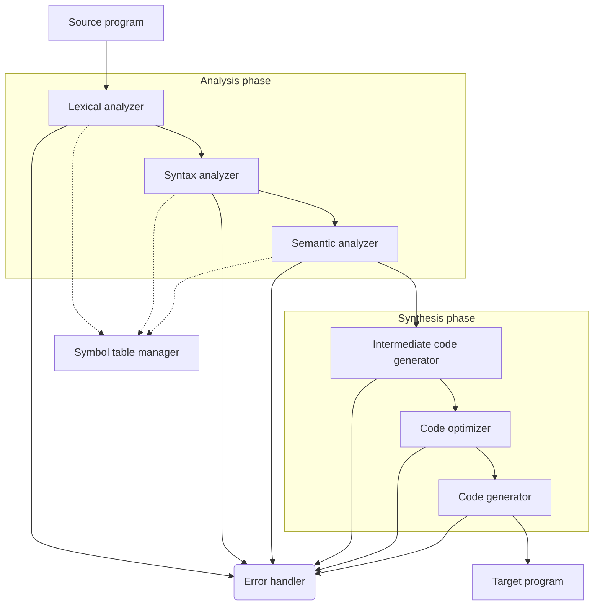

# 第1章 编译原理简介

## 1.1 语言处理器

**编译器**（**Compiler**）的任务：

- 输入：读取用源语言编写的程序
- 处理：将其翻译
- 输出：为等价的目标语言程序

> “源语言（source language）” → “目标语言（target language）”

编程语言的本质：编程语言是一种既面向人又面向机器的计算描述符号体系。

## 1.2 编译器结构

| 阶段     | 内容                                                         |
| -------- | ------------------------------------------------------------ |
| 词法分析 Lexical Analysis | 分词，识别单词符号	|
|语法分析 Syntax Analysis|	检查语法结构是否符合规范|
|语义分析 Semantic Analysis|	验证语义是否合规，例如变量是否定义|
|中间代码生成 IR Generation|	平台无关的中间表示|
|优化 Code Optimization|	改进代码效率或性能|
|目标代码生成 Code Generation|	平台相关的机器代码 |

## 1.3 编译过程

**符号表**（**Symbol Table**）：编译过程中用于记录变量、函数等标识符的信息。

