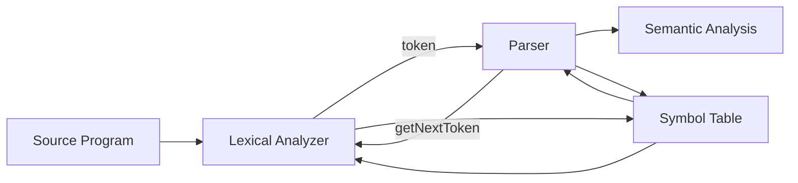

# 第2章 词法分析

## 2.1 词法分析器



### 2.1.1 Lexer 的作用

词法分析分两步：

1. **Scanning 扫描**

   不做词法识别，仅处理空格、注释、宏展开等预处理。

   去除空白字符（空格、换行、制表符）。

   > 不一定，Python 中空白字符可能是有意义的 token。

2. **Lexical Analysis 词法分析**

   将输入转换为 Token 序列。

产生**词法单元**（**Tokens**）/**词素**（**Lexemes**）

- **Token**：<类型, 属性>

  示例：

  - id → <id, symbolTableEntry>
  - 60 → <number, 60>
  - 类型用于语法分析，属性值用于后续翻译。

- **Lexeme**：某个 token 的实际文本实例，如 “rate” 是 identifier 的一个词素。

语法分析的过程中主要使用token，基本不使用attribute项的内容。


### 2.1.2 常见词法元素

| **Token 类型**          | **描述**                                 | **示例**                    |
| ----------------------- | ---------------------------------------- | --------------------------- |
| Keyword                 | 关键字，语言保留字                       | if, while, return, let      |
| Identifier              | 标识符，变量名/函数名/类型名等           | position, x, calculateTotal |
| Operator                | 运算符（算术、赋值、比较等）             | +, -, *, /, =, ==           |
| Delimiter / Punctuation | 分隔符、标点符号（语法结构）             | (, ), {, }, ,, ;            |
| Literal                 | 字面值，包括：数字、字符串、布尔值等     | 123, "abc", 'c', true       |
| Number                  | 数值常量（可归为 Literal 子类）          | 42, 3.14, 0xFF              |
| String                  | 字符串常量（可归为 Literal 子类）        | "hello", 'world'            |
| Comment                 | 注释内容（通常在扫描阶段会被移除）       | // comment, /* comment */   |
| Whitespace              | 空格、换行、制表符等（通常不生成 token） | " ", "\n", "\t"             |
| Boolean                 | 布尔值常量                               | true, false                 |
| Null / Undefined        | 特殊字面值                               | null, undefined（语言相关） |


## 2.2 字符串与语言

### 2.2.1 字母表

**字母表（Alphabet）**：有限符号集合，如 {a, b}。

### 2.2.2 字符串

**字符串（String）**：字母表符号组成的有限序列，如 “ab”, “aab”。

| **名称**              | **定义**                       |
| --------------------- | ------------------------------ |
| 空串（$\varepsilon$） | 不包含任何符号的字符串         |
| 前缀（Prefix）        | 删除尾部若干字符               |
| 后缀（Suffix）        | 删除开头若干字符               |
| 子串（Substring）     | 删除任意前缀和后缀             |
| 子序列（Subsequence） | 保留部分字符，顺序不变，可跳跃 |

1. 字符串长度

   用 |s| 表示字符串 s 的长度。

   空串（ε）的长度为 0，即：|ε| = 0

2. **字符串的连接（Concatenation）**

   若 x 和 y 是字符串，则 xy 表示将 y 接在 x 后面的结果，称为 x 和 y 的连接（concatenation）。

   示例：如果 x = dog，y = house，那么 xy = doghouse

3. **连接的幺元（identity element）**

   从离散数学的角度讲，在字符串连接操作下，空串 ε 是连接操作的幺元。

   对任意字符串 s，有：εs = se = s

4. 字符串的**子序列**（**Subsequence**）

   如果 s 是一个字符串，**子序列**指的是通过**删除零个或多个字符（不要求连续）**后得到的任意字符串。

### 2.2.3 语言

**语言**是定义在某个字母表上的字符串集合，且该集合是“可数的”（countable）。

> 通常是**可数无穷**的。

语言可以通过**文法（grammar）**来构造，即通过规则（产生式）系统地定义哪些字符串属于语言。

> 语言的定义**不要求**字符串具有“意义”。

**语言的操作**：把语言当成字符串去进行数学处理。

1️⃣ **并（Union）**

- **定义**：$L ∪ M = {s | s ∈ L 或 s ∈ M}$

- **理解**：把两个语言里的字符串合在一起，去重。

- **例子**：

  L = {“a”, “b”}, M = {“b”, “c”} → L ∪ M = {“a”, “b”, “c”}

2️⃣ **串接（Concatenation）**

- **定义**：$LM = {st | s ∈ L, t ∈ M}$

- **理解**：L 中的每个字符串跟 M 中的每个字符串拼接（笛卡尔积）

- **例子**：

  L = {“a”, “b”}, M = {“c”, “d”} → LM = {“ac”, “ad”, “bc”, “bd”}

**3️⃣ 幂（Power）**

- **定义**：$A^n$ 表示把集合 A 中的字符串串接 n 次
- **例子**：
  - A = {“a”, “b”}
  - A¹ = {“a”, “b”}
  - A² = {“aa”, “ab”, “ba”, “bb”}（长度为 2 的所有组合）
  - A³ = A²A = {“aaa”, “aab”, …, “bbb”}（8 个）

> 如果 A 有 m 个元素，不含 ε：

> |A⁰| = 1，|A¹| = m，|Aⁿ| = mⁿ

4️⃣ **Kleene 闭包（Kleene Closure）**

- **定义**：$A* = A^0 ∪ A^1 ∪ A^2 ∪ A^3 ∪ ...$
- **理解**：包含任意次串接的所有字符串（含 ε）
- **例子**：A = {“a”, “b”} → A* 包含：ε, “a”, “b”, “aa”, “ab”, “ba”, “bb”, “aaa”,…

5️⃣ **正闭包**（**Positive Closure**） **A+**

- **定义**：$A* = A^0 ∪ A^1 ∪ A^2 ∪ A^3 ∪ ... - \{\varepsilon\}$
- **理解**：跟 Kleene 闭包一样，但不包括空串 ε


## 2.3 上下文无关文法

一个**上下文无关文法**（**Context-Free Grammar**, **CFG**）G 定义为：

```
G = (V, T, P, S)
```

| **符号** | **含义**                 |
| -------- | ------------------------ |
| T        | 终结符集合（tokens）     |
| V        | 非终结符集合（语法变量） |
| P        | 产生式集合               |
| S        | 起始符号（start symbol） |

产生式格式：

```
A → α
```

其中：

- A 是一个非终结符（左部）

- α 是一个终结符和/或非终结符的序列（右部）


在产生式 A → α 中，你可以在任何时候看到 A，就把它换成 α。不需要考虑 A 出现在什么上下文中，所以叫 **上下文无关文法**（Context-Free Grammar）。

所谓终结符，就是“实际出现的字符”或“词法分析后得到的 token”，例如：+、*、(、)、id 等，它们是最终出现在 AST 中的叶子节点。而还可以通过产生式进行“拆分”的就是“非终结符”。

起始符号则是一个抽象的解析开始符号，通常是最顶层的表达式。
