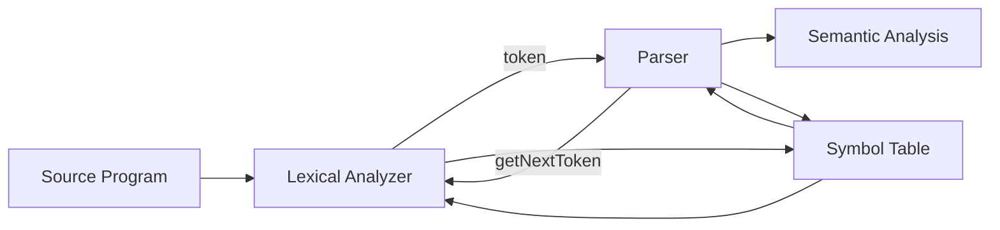
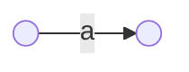
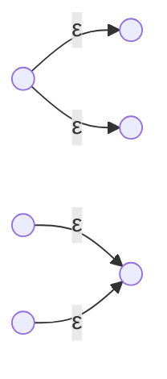
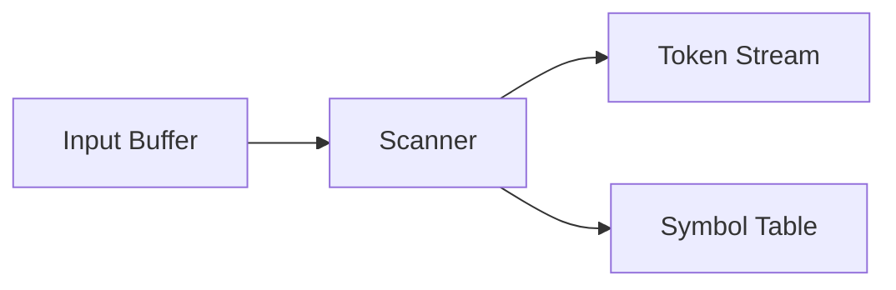

# 第2章 词法分析

## 2.1 词法分析器



### 2.1.1 Lexer 的作用

词法分析分两步：

1. **Scanning 扫描**

   不做词法识别，仅处理空格、注释、宏展开等预处理。

   去除空白字符（空格、换行、制表符）。

   > 不一定，Python 中空白字符可能是有意义的 token。

2. **Lexical Analysis 词法分析**

   将输入转换为 Token 序列。

产生**词法单元**（**Tokens**）/**词素**（**Lexemes**）

- **Token**：<类型, 属性>

  示例：

  - id → <id, symbolTableEntry>
  - 60 → <number, 60>
  - 类型用于语法分析，属性值用于后续翻译。

- **Lexeme**：某个 token 的实际文本实例，如 “rate” 是 identifier 的一个词素。

语法分析的过程中主要使用token，基本不使用attribute项的内容。


### 2.1.2 常见词法元素

| **Token 类型**          | **描述**                                 | **示例**                    |
| ----------------------- | ---------------------------------------- | --------------------------- |
| Keyword                 | 关键字，语言保留字                       | if, while, return, let      |
| Identifier              | 标识符，变量名/函数名/类型名等           | position, x, calculateTotal |
| Operator                | 运算符（算术、赋值、比较等）             | +, -, *, /, =, ==           |
| Delimiter / Punctuation | 分隔符、标点符号（语法结构）             | (, ), {, }, ,, ;            |
| Literal                 | 字面值，包括：数字、字符串、布尔值等     | 123, "abc", 'c', true       |
| Number                  | 数值常量（可归为 Literal 子类）          | 42, 3.14, 0xFF              |
| String                  | 字符串常量（可归为 Literal 子类）        | "hello", 'world'            |
| Comment                 | 注释内容（通常在扫描阶段会被移除）       | // comment, /* comment */   |
| Whitespace              | 空格、换行、制表符等（通常不生成 token） | " ", "\n", "\t"             |
| Boolean                 | 布尔值常量                               | true, false                 |
| Null / Undefined        | 特殊字面值                               | null, undefined（语言相关） |


## 2.2 字符串与语言

### 2.2.1 字母表

**字母表（Alphabet）**：有限符号集合，如 \{a, b\}。

### 2.2.2 字符串

**字符串（String）**：字母表符号组成的有限序列，如 “ab”, “aab”。

| **名称**              | **定义**                       |
| --------------------- | ------------------------------ |
| 空串（$\varepsilon$） | 不包含任何符号的字符串         |
| 前缀（Prefix）        | 删除尾部若干字符               |
| 后缀（Suffix）        | 删除开头若干字符               |
| 子串（Substring）     | 删除任意前缀和后缀             |
| 子序列（Subsequence） | 保留部分字符，顺序不变，可跳跃 |

1. 字符串长度

   用 |s| 表示字符串 s 的长度。

   空串（ε）的长度为 0，即：|ε| = 0

2. **字符串的连接（Concatenation）**

   若 x 和 y 是字符串，则 xy 表示将 y 接在 x 后面的结果，称为 x 和 y 的连接（concatenation）。

   示例：如果 x = dog，y = house，那么 xy = doghouse

3. **连接的幺元（identity element）**

   从离散数学的角度讲，在字符串连接操作下，空串 ε 是连接操作的幺元。

   对任意字符串 s，有：εs = se = s

4. 字符串的**子序列**（**Subsequence**）

   如果 s 是一个字符串，**子序列**指的是通过**删除零个或多个字符（不要求连续）**后得到的任意字符串。

### 2.2.3 语言

**语言**是定义在某个字母表上的字符串集合，且该集合是“可数的”（countable）。

> 通常是**可数无穷**的。

语言可以通过**文法（grammar）**来构造，即通过规则（产生式）系统地定义哪些字符串属于语言。

> 语言的定义**不要求**字符串具有“意义”。

**语言的操作**：把语言当成字符串去进行数学处理。

1️⃣ **并（Union）**

- **定义**：$L ∪ M = {s | s ∈ L 或 s ∈ M}$

- **理解**：把两个语言里的字符串合在一起，去重。

- **例子**：

  L = \{"a", "b"\}, M = \{"b", "c"\} → L ∪ M = \{"a", "b", "c"\}

2️⃣ **串接（Concatenation）**

- **定义**：$LM = {st | s ∈ L, t ∈ M}$

- **理解**：L 中的每个字符串跟 M 中的每个字符串拼接（笛卡尔积）

- **例子**：

  L = \{"a", "b"\}, M = \{"c", "d"\} → LM = \{"ac", "ad", "bc", "bd"\}

**3️⃣ 幂（Power）**

- **定义**：$A^n$ 表示把集合 A 中的字符串串接 n 次
- **例子**：
  - A = \{"a", "b"\}
  - A¹ = \{"a", "b"\}
  - A² = \{"aa", "ab", "ba", "bb"\}（长度为 2 的所有组合）
  - A³ = A²A = \{"aaa", "aab", …, "bbb"\}（8 个）

> 如果 A 有 m 个元素，不含 ε：
> 
> |A⁰| = 1，|A¹| = m，|Aⁿ| = mⁿ

4️⃣ **Kleene 闭包（Kleene Closure）**

- **定义**：$A* = A^0 ∪ A^1 ∪ A^2 ∪ A^3 ∪ ...$
- **理解**：包含任意次串接的所有字符串（含 ε）
- **例子**：A = \{"a", "b"\} → A* 包含：ε, "a", "b", "aa", "ab", "ba", "bb", "aaa",…

5️⃣ **正闭包**（**Positive Closure**） **A+**

- **定义**：$A* = A^0 ∪ A^1 ∪ A^2 ∪ A^3 ∪ ... - \{\varepsilon\}$
- **理解**：跟 Kleene 闭包一样，但不包括空串 ε


## 2.3 线性文法与正规文法

### 2.3.1 线性文法

**线性文法（Linear Grammar）**：每条产生式右部**至多包含一个非终结符**。

- **右线性文法**（Right-linear）
  - 形式：`A → w` 或 `A → wB`
  - 非终结符在**最右侧**

- **左线性文法**（Left-linear）
  - 形式：`A → w` 或 `A → Bw`
  - 非终结符在**最左侧**

> 线性文法生成的语言是**正规语言（Regular Language）**。

示例：

```
S → aS | b
```

对应语言：`a* b`

### 2.3.2 正规文法

**正规文法（Regular Grammar）**：右侧**至多一个非终结符**，且只能出现在**一端**。

- 右线性文法是正规文法
- 左线性文法也是正规文法
- 但**混合左右**的不一定是正规文法

集合关系：

```
正规文法 ⊂ 线性文法 ⊂ 上下文无关文法（CFG）
```

**三大核心概念的对应关系**：

| **概念**                          | **用途**               | **本质**            |
| --------------------------------- | ---------------------- | ------------------- |
| 正规式（Regular Expression）      | 描述词法元素长什么样子 | Pattern（模式）     |
| 正规文法（Regular Grammar）       | 构造词法元素           | Process（构造过程） |
| 有限状态自动机（Finite Automata） | 识别词法元素           | Program（识别程序） |


## 2.4 正规式（Regular Expression）

### 2.4.1 基本定义

**正规式**用于描述**字符串集合（正规语言）**。

设字母表为 Σ，正规式的构造规则：

1. **基础**
   - `∅` 表示空集
   - `ε` 表示空串
   - `a`（a ∈ Σ）表示单字符集合 `{a}`

2. **运算**
   - **并**：`r | s`
   - **连接**：`rs`
   - **闭包**：`r*`

### 2.4.2 运算含义

- `r | s`：两个语言的并集
- `rs`：两个语言的串接
- `r*`：Kleene 闭包（任意次重复，含空串）

### 2.4.3 书写习惯与优先级

常用约定：

1. `*` 最高
2. 连接次之
3. `|` 最低

括号用于改变优先级：

```
(a|b)*abb
```

表示以 `abb` 结尾，且前缀由 `a` 和 `b` 组成的任意字符串。

### 2.4.4 正规定义（Regular Definitions）

**正规定义**是“给正规式命名再复用”的机制。

示例：

```
letter → A|B|...|Z|a|b|...|z
 digit → 0|1|...|9
 id    → letter(letter|digit)*
```

- `id` 描述了**标识符**的模式
- 便于构造完整的词法规则库

### 2.4.5 正规式的扩展写法（常见简写）

| 写法  | 含义                         | 例子            |
| ----- | ---------------------------- | --------------- |
| `r+`  | `rr*`（至少一次）            | `digit+`        |
| `r?`  | `r|ε`（可有可无）            | `sign?`         |
| `[a-z]` | 字符范围（语法糖）         | `[A-Za-z_]`     |


## 2.5 有限状态自动机（Finite Automata）

### 2.5.1 DFA 与 NFA

**确定有限自动机（DFA）**：
- 每个状态对每个输入符号**最多一条**转移
- 不存在 ε 转移

**非确定有限自动机（NFA）**：
- 同一输入符号可以有**多个**转移
- 可以有 ε 转移

两者**识别能力等价**，DFA更易实现，NFA更易构造。

### 2.5.2 形式化定义（五元组）

```
M = (Q, Σ, δ, q0, F)
```

| 符号 | 含义 |
| ---- | ---- |
| Q    | 状态集合 |
| Σ    | 输入字母表 |
| δ    | 转移函数 |
| q0   | 初始状态 |
| F    | 接受状态集合 |

### 2.5.3 接受字符串的含义

一个字符串 `w` 被自动机接受，表示从 `q0` 出发，读完 `w` 后到达某个接受状态。

### 2.5.4 ε-闭包（ε-closure）

**ε-闭包**：从某个状态出发，只走 ε 转移能到达的所有状态集合（包含自身）。

在 NFA → DFA 的转换中必须使用。


## 2.6 正规式 ↔ 自动机

### 2.6.1 正规式 → NFA（Thompson 构造）

核心思路：为正规式的**每个结构**提供一个“小模板”，再用 ε 边拼起来。

**四个基础模板**（背住即可）：  

1️⃣ **单字符** `a`



2️⃣ **并** `r | s`：一个入口，两条 ε 分叉，两个出口再 ε 合并



3️⃣ **连接** `rs`：把 r 的终态用 ε 连到 s 的初态

```
r  --ε-->  s
```

4️⃣ **闭包** `r*`：允许 0 次或多次

```
s --ε--> f
s --ε--> r0
r1 --ε--> r0
r1 --ε--> f
```

> 口诀：**并分叉、连串联、闭包回环+ε**。

**完整例子：构造 `a(b|c)*` 的 NFA**

拆成四步：  

1. `a` 的小 NFA  
2. `b|c` 的并结构  
3. 对 `(b|c)` 做闭包  
4. 把 `a` 和 `(b|c)*` 串联  

最终得到一个 NFA：  

- 初态读 `a` 进入闭包结构  
- 闭包中反复读 `b` 或 `c`（也可以不读）  

**结论**：该 NFA 识别的就是 `a(b|c)*`。

### 2.6.2 NFA → DFA（子集构造法）

核心思想：  

> **DFA 的一个状态 = NFA 的一个状态集合**。

**必要定义**：  

- `ε-closure(T)`：从集合 T 出发，只走 ε 能到达的所有状态  
- `move(T, a)`：从 T 中任意状态出发，读 a 可达的状态集合  

**算法步骤**：  

1. 初始状态：`I0 = ε-closure({q0})`  
2. 对每个 DFA 状态 T 和每个输入符号 a：  
   - 先算 `U = move(T, a)`  
   - 再算 `ε-closure(U)`  
3. 出现的新集合加入 DFA 状态集  
4. 集合中**包含 NFA 接受态** → DFA 接受态  

**例子（完整走一遍）**  

给一个短 NFA：  

- 状态：`0,1,2`  
- 初态：`0`  
- 接受态：`2`  
- 转移：  
  - `0 --a--> 0`  
  - `0 --b--> 0`  
  - `0 --a--> 1`  
  - `1 --b--> 2`  

用子集构造（Σ = {a,b}）：  

1. 初始：`{0}`  
2. `{0}` 读 a：`move = {0,1}` → 新状态 `{0,1}`  
3. `{0}` 读 b：`move = {0}` → 还是 `{0}`  
4. `{0,1}` 读 a：`move = {0,1}` → 自环  
5. `{0,1}` 读 b：`move = {0,2}` → 新状态 `{0,2}`  
6. `{0,2}` 读 a：`move = {0,1}`  
7. `{0,2}` 读 b：`move = {0}`  

最终 DFA 状态集合：  

- `{0}`  
- `{0,1}`  
- `{0,2}`（包含 NFA 接受态 2 → DFA 接受态）  

### 2.6.3 DFA 最小化（Minimization）

核心目标：  

> 合并“**无法区分**”的状态。

**等价状态**：  

- 若从两个状态出发，对任意输入串的接受结果都相同  
- 则可合并  

**常用方法：划分等价类**  

步骤：  

1. 初始划分：接受态 / 非接受态  
2. 细分：若同组内两个状态在某输入下转移到**不同组** → 拆分  
3. 重复直到稳定  

**例子（完整走一遍）**  

给定 DFA：  

```
状态集：{A,B,C,D}
接受态：{C,D}
字母表：{0,1}

转移：
A --0--> B   A --1--> C
B --0--> A   B --1--> D
C --0--> C   C --1--> D
D --0--> C   D --1--> D
```

1) 初始划分：  

- P0 = { {C,D}, {A,B} }  

2) 检查 {A,B}：  

- A 在 1 上到 C（接受态组）  
- B 在 1 上到 D（接受态组）  
- A 在 0 上到 B（非接受态组）  
- B 在 0 上到 A（非接受态组）  

转移落点一致 → **A 与 B 保持同组**。  

3) 检查 {C,D}：  

- C 在 0 上到 C（接受态组）  
- D 在 0 上到 C（接受态组）  
- C 在 1 上到 D（接受态组）  
- D 在 1 上到 D（接受态组）  

仍一致 → **C 与 D 可合并**。  

最终划分：  

- {A,B}  
- {C,D}  

所以最小 DFA 只有 **2 个状态**。  

**方法论总结**：  

- 先分接受/非接受  
- 再看“同组内的转移落点”是否一致  
- 不一致就拆，直到稳定  

### 2.6.4 贯通例题：正规式 → NFA → DFA → 最小化

我们用一个**完整例子**走一遍四步流程。  

正规式：  

```
r = a(b|c)*
```

含义：以 `a` 开头，后面是任意多个 `b` 或 `c`（也可以没有）。

#### Step 1：Thompson 构造 NFA

按模板分解：  

- `a`  
- `b|c`  
- `(b|c)*`  
- 连接  

给出一套可行的 NFA（编号便于后续子集构造）：  

```
0 --a--> 1
1 --ε--> 8

6 --ε--> 2
6 --ε--> 4
2 --b--> 3
4 --c--> 5
3 --ε--> 7
5 --ε--> 7

8 --ε--> 6
8 --ε--> 9
7 --ε--> 6
7 --ε--> 9
```

初态：0  
终态：9  

> 结构就是“a 的 NFA”连接“(b|c)* 的 NFA”。

#### Step 2：NFA → DFA（子集构造）

字母表：`{a, b, c}`  

先算几个 ε-closure：  

```
ε-closure(0) = {0}
ε-closure(1) = {1,8,6,2,4,9}
ε-closure(3) = {3,7,6,2,4,9}
ε-closure(5) = {5,7,6,2,4,9}
```

DFA 状态命名：  

```
A = {0}
B = {1,8,6,2,4,9}
C = {3,7,6,2,4,9}
E = {5,7,6,2,4,9}
D = ∅  (死状态)
```

子集构造得到的主要转移：  

```
A --a--> B
A --b--> D
A --c--> D

B --a--> D
B --b--> C
B --c--> E

C --a--> D
C --b--> C
C --c--> E

E --a--> D
E --b--> C
E --c--> E

D --a--> D
D --b--> D
D --c--> D
```

接受态：包含 NFA 接受态 9 的集合 → `B、C、E`  

#### Step 3：DFA 最小化

初始划分：  

- 接受态：`{B, C, E}`  
- 非接受态：`{A, D}`  

检查 `{B, C, E}`：  

- 在 a 上都到 D  
- 在 b/c 上都落到 `{B,C,E}`  

因此三者**等价，可合并**。  

检查 `{A, D}`：  

- A 在 a 上到接受态  
- D 在 a 上仍为非接受态  

所以 A 与 D 不能合并。  

最小 DFA：  

- `A`（初态）  
- `S`（合并后的接受态：B/C/E）  
- `D`（死状态）  

转移：  

```
A --a--> S
A --b--> D
A --c--> D

S --a--> D
S --b--> S
S --c--> S

D --a--> D
D --b--> D
D --c--> D
```

#### Step 4：结果核对

最小 DFA 能识别：  

- `a`  
- `ab`  
- `ac`  
- `abbbcc`  
- `acccb`  

不能识别：  

- `b`（必须以 a 开头）  
- `aa`（第二个 a 不在 b/c* 中）  
- `ba`  

与正规式 `a(b|c)*` 完全一致。  

> 这个例子展示了：**模板构造 NFA → 子集构造 DFA → 等价类最小化** 的完整闭环。

### 2.6.5 文法 ↔ 自动机（了解）

- **右线性文法 → NFA**
  - 每个非终结符 ≈ 一个状态
  - 产生式决定转移

- **NFA → 右线性文法**
  - 每个状态生成一个非终结符
  - 迁移 `p -a-> q` 变为产生式 `P → aQ`


## 2.7 词法分析器的实现

### 2.7.1 转移图（Transition Diagram）

转移图 = 用自动机画出“识别一个 token 的流程”。

每个 token 一张图，词法分析器在图之间切换。

### 2.7.2 保留字与标识符

**问题**：关键字与标识符形式相似，如 `if` 与 `id`。

常见做法：

1. 先按 `id` 规则匹配
2. 查符号表/关键字表
3. 若是关键字 → 返回 `keyword` token
4. 否则 → 返回 `id` token

### 2.7.3 最长匹配原则

**Longest Match**：

- 能匹配多长就匹配多长
- 例如：`<=` 不应该被拆成 `<` 和 `=`

### 2.7.4 词法分析器的典型结构



关键指针：

- `lexeme_begin`：当前词素起点
- `forward`：向前扫描

常用技巧：**双缓冲**，减少 I/O 开销。

### 2.7.5 词法错误处理

常见错误：

- 未识别字符
- 字符串未闭合
- 非法数字格式

处理方式：

- 报错 + 跳过非法字符
- 或返回 `ERROR` token 交给语法分析器处理

## 可视化：Thompson 构造法 (Regex to NFA)

输入正则表达式（支持 `|`, `*`, `()`)，自动生成对应的 NFA。

<RegexToNfa />

## 可视化：子集构造法 (NFA to DFA)

输入正则表达式，先生成 NFA（Thompson 算法），再自动转换为 DFA（子集构造法）。

<NfaToDfa />
