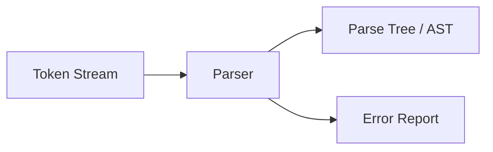

# 第3章 语法分析

## 3.1 语法分析器

**语法分析器（Parser）**的任务：

- **输入**：词法分析器产生的 token 序列
- **处理**：根据文法判断结构是否合法
- **输出**：语法树/抽象语法树（AST）或错误信息

语法分析的关键：

- 使用**上下文无关文法（CFG）**描述语言结构
- 解析过程可以是**自顶向下**或**自底向上**




## 3.2 文法与二义性

### 3.2.1 语法树与最左/最右推导

**最左推导**：每次替换最左非终结符

**最右推导**：每次替换最右非终结符

这两种推导方式不同，但都能生成**同一棵语法树**（若文法无二义）。

### 3.2.2 二义性（Ambiguity）

**二义文法**：同一个字符串能生成**两棵不同的语法树**。

经典例子：

```
E → E + E | E * E | id
```

字符串 `id + id * id` 可以有两种解析：

- `+` 先结合
- `*` 先结合

**解决办法**：

- 改写文法（消除二义性）
- 或在语法分析器中人为指定结合性与优先级


## 3.3 自顶向下分析（Top-Down Parsing）

### 3.3.1 基本思想

从**起始符号**出发，尝试“展开”产生式，使其匹配输入 token。

两种典型方法：

- 递归下降（Recursive Descent）
- 预测分析（Predictive Parsing，LL(1)）

### 3.3.2 消除左递归

左递归会导致自顶向下分析**无限递归**。

一般形式：

```
A → Aα | β
```

消除后：

```
A  → βA'
A' → αA' | ε
```

### 3.3.3 提取左公因子（Left Factoring）

当多个产生式有**公共前缀**时，会导致预测冲突。

```
A → αβ1 | αβ2
```

提取后：

```
A  → αA'
A' → β1 | β2
```

### 3.3.4 FIRST 集合

**FIRST(X)**：从 X 推导出的串中，**第一个终结符**的集合。

规则：

- 若 `X` 是终结符：FIRST(X) = {X}
- 若 `X → Y1Y2...Yk`
  - 把 FIRST(Y1) 中非 ε 的符号加入
  - 若 FIRST(Y1) 含 ε，再看 Y2...
- 若所有 Yi 都能推出 ε，则 ε 属于 FIRST(X)

### 3.3.5 FOLLOW 集合

**FOLLOW(A)**：在某句型中**紧跟在 A 后面**可能出现的终结符集合。

规则：

- 起始符号：`$` ∈ FOLLOW(S)
- 若 `A → αBβ`，则 FIRST(β)\{ε} ⊆ FOLLOW(B)
- 若 `A → αB` 或 `A → αBβ` 且 β ⇒* ε，则 FOLLOW(A) ⊆ FOLLOW(B)

### 3.3.6 LL(1) 预测分析表

**LL(1)**：

- L：从左到右读输入
- L：最左推导
- 1：向前看 1 个 token

**LL(1) 的核心要求**：

- 对每个非终结符 A，任一输入符号只能选择**唯一产生式**
- 换句话说：预测表 **不能冲突**

**构造表格**：

- 对产生式 `A → α`
- 对每个 `a ∈ FIRST(α)`，填入 `M[A, a] = A → α`
- 若 ε ∈ FIRST(α)，对每个 `b ∈ FOLLOW(A)`，填入 `M[A, b] = A → α`

**LL(1) 判定条件（常用口径）**：

对任意 A：

- 若 `A → α | β`  
  - FIRST(α) 与 FIRST(β) 不相交  
  - 若 ε ∈ FIRST(α)，则 FIRST(β) 与 FOLLOW(A) 不相交  
  - 若 ε ∈ FIRST(β)，则 FIRST(α) 与 FOLLOW(A) 不相交  

**预测分析算法**：

- **栈顶是非终结符**：查表替换产生式
- **栈顶是终结符**：与输入匹配则弹栈

**例子：构造 LL(1) 表并分析**

文法（已消左递归）：  

```
E  → T E'
E' → + T E' | ε
T  → F T'
T' → * F T' | ε
F  → ( E ) | id
```

关键 FIRST / FOLLOW：  

- FIRST(E) = { id, ( }  
- FIRST(E') = { +, ε }  
- FOLLOW(E) = { ), $ }  

构造表的典型填项：  

- `M[E, id] = E → T E'`  
- `M[E, (] = E → T E'`  
- `M[E', +] = E' → + T E'`  
- `M[E', )] = E' → ε`  
- `M[E', $] = E' → ε`  

分析过程（输入：`id + id * id`）：  

1. 栈顶 `E`，看 `id` → 用 `E → T E'`  
2. 继续展开 `T → F T'`，`F → id` 匹配  
3. 遇到 `+` → 用 `E' → + T E'`  
4. `T` 中遇到 `id * id`，`T'` 选择 `* F T'`  

> 关键点：**每一步都由当前输入符号唯一决定产生式**。


## 3.4 自底向上分析（Bottom-Up Parsing）

### 3.4.1 基本思想

从输入串出发，**逐步归约**到起始符号。

常见方法：

- 移进-归约分析（Shift-Reduce）
- LR 系列分析器

### 3.4.2 移进-归约（Shift-Reduce）

两个动作：

- **Shift**：读入下一个 token，压栈
- **Reduce**：用产生式右部替换为左部

**句柄（Handle）**：

- 当前句型中**下一次归约的子串**

### 3.4.3 LR 分析的核心概念

**项目（Item）**：

```
A → α · β
```

点表示**已识别到的位置**。

**LR 状态**：项目集合。

**DFA**：通过 GOTO 和 CLOSURE 构造 LR 自动机。

### 3.4.4 LR(1) 项目与分析表

**LR(1) 项目（Item）**：

```
[A → α · β, a]
```

含义：  

- 点前 α 已识别  
- 点后 β 待识别  
- `a` 是**展望符**（lookahead），表示何时归约  

**核心思想**：  

- LR(0) 只看项目本身  
- LR(1) 额外带 1 个展望符 → 更精确  

**构造 LR(1) 自动机的两步**：  

1. **Closure**  
   - 若 `[A → α · B β, a]` 在集合中  
   - 对 B 的每个产生式 `B → γ`  
   - 加入 `[B → · γ, b]`  
   - 其中 `b ∈ FIRST(βa)`  

2. **Goto**  
   - 把点右移得到新集合  

**分析表（ACTION / GOTO）**：  

- 若 `[A → α · a β, b]` 且 a 为终结符 → ACTION[状态, a] = shift  
- 若 `[A → α ·, a]` → ACTION[状态, a] = reduce A → α  
- 若 `[S' → S ·, $]` → ACTION = accept  
- 非终结符用 GOTO 表连接状态  

> LR(1) 通过展望符减少错误归约，是“最强”的 LR 方法。

### 3.4.5 LR(0) / SLR / LR(1) / LALR

| 方法 | 特点 | 优缺点 |
| ---- | ---- | ------ |
| LR(0) | 只看项目 | 能力弱，易冲突 |
| SLR  | 加 FOLLOW | 比 LR(0) 强 |
| LR(1) | 项目带 1 个展望符 | 能力最强，表大 |
| LALR | 合并 LR(1) 核 | 表小、实用性强 |

### 3.4.6 冲突类型

- **移进/归约冲突**
- **归约/归约冲突**

出现冲突意味着：

- 文法不是该类分析器可处理
- 或需要改写文法（如消二义）


## 3.5 语法错误处理

常见策略：

1. **恐慌模式（Panic Mode）**
   - 跳过输入符号直到同步点
   - 同步点常取 FOLLOW 集合

2. **短语级恢复（Phrase-Level）**
   - 局部修补（插入、删除、替换）

3. **错误产生式（Error Productions）**
   - 在文法中加入错误规则

目的：

- 尽可能继续分析
- 在一次编译中报告更多错误


## 3.6 本章结构回顾

1. **语法分析器职责**：检查结构、构建语法树
2. **文法问题**：二义性、左递归、左公因子
3. **自顶向下**：LL(1)、FIRST/FOLLOW、预测分析表
4. **自底向上**：移进-归约、LR 项目、LR 系列
5. **错误处理**：同步点与恢复策略

## 可视化：自动计算 FIRST 和 FOLLOW 集

输入文法，自动计算所有非终结符的 FIRST 和 FOLLOW 集合。

<FirstFollow />

## 可视化：LL(1) 预测分析表生成器

输入文法，自动完成以下步骤：
1. 计算 FIRST / FOLLOW 集合
2. 构造预测分析表
3. 检测冲突并判断是否为 LL(1) 文法

<LL1Analyzer />
