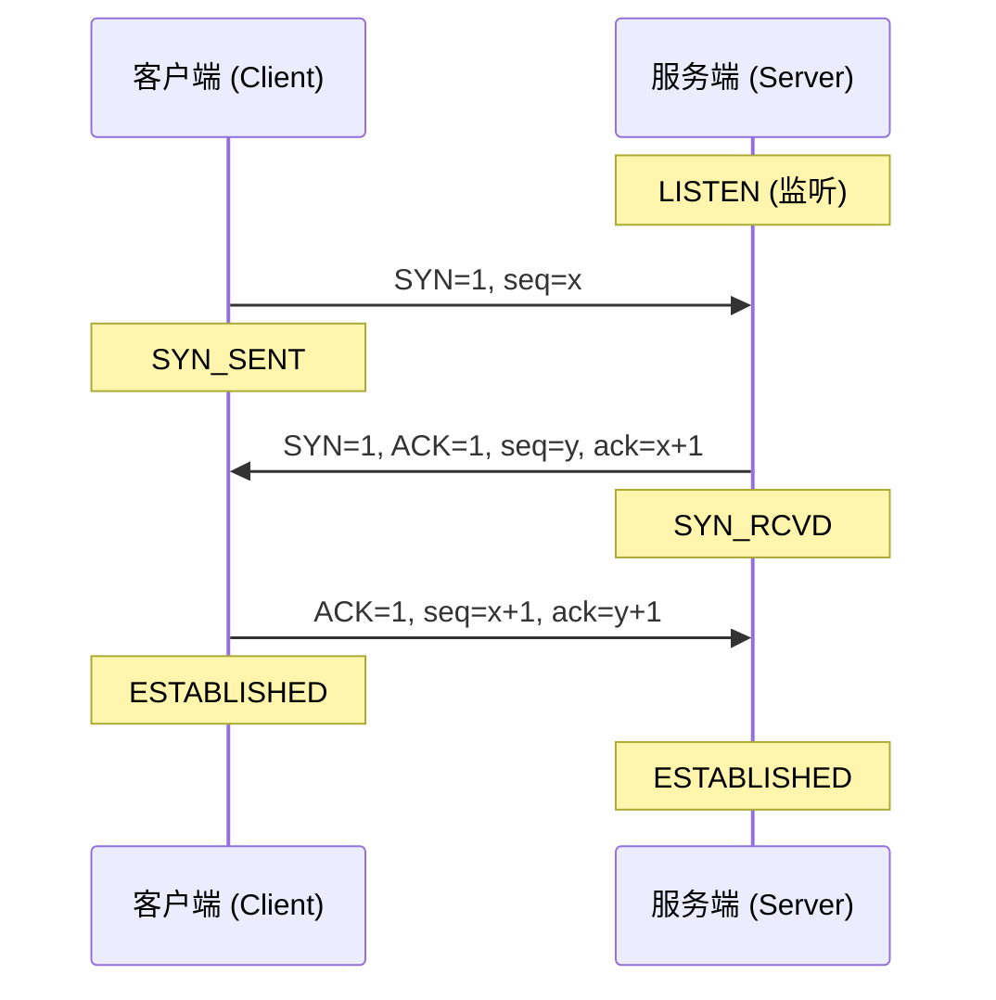
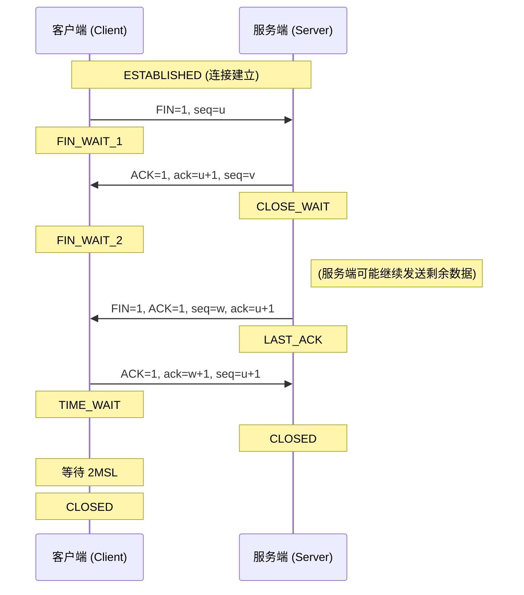
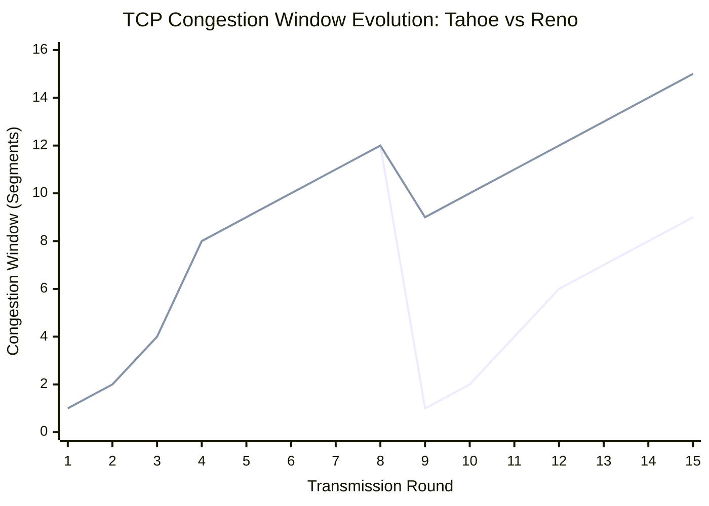

# 第3章 传输层

## 3.1 传输层概述

### 3.1.1 传输层的功能
传输层（Transport Layer）的核心任务是为运行在不同主机上的**应用进程**提供**逻辑通信 (Logical Communication)**。
*   **逻辑通信**：虽然两个进程实际上是通过通过众多路由器和链路连接的，但在应用进程看来，它们好像是直接通过一条逻辑信道相连的。
*   **端系统运行**：传输层协议**只在端系统（End Systems）中运行**，网络核心中的路由器一般只处理到网络层（L3），不处理传输层协议。
*   **报文段处理**：
    *   **发送方**：将应用层报文分成**报文段 (Segment)**，传递给网络层。
    *   **接收方**：将报文段重组为应用报文，传递给应用层。

### 3.1.2 传输层的位置
传输层位于协议栈的中心位置：
*   **向上**：为应用层提供服务（进程到进程的通信）。
*   **向下**：利用网络层的服务（主机到主机的通信）。

### 3.1.3 数据单元
传输层的协议数据单元 (PDU) 统称为**报文段 (Segment)**。
*   **TCP**：严格称为 **Segment**（报文段）。
*   **UDP**：严格称为 **Datagram**（数据报）。
    *   *注意*：网络层 IP 分组也常被称为 Datagram，为了避免混淆，通常统称传输层 PDU 为 Segment，或特指 UDP Datagram。

### 3.1.4 传输层与网络层的关系
*   **网络层**：提供了**主机到主机 (Host-to-Host)** 的逻辑通信。
*   **传输层**：提供了**进程到进程 (Process-to-Process)** 的逻辑通信。
*   **类比理解**：
    *   **主机** = 房子 (House)
    *   **进程** = 房子里的孩子 (Kids)
    *   **应用报文** = 信件 (Letters)
    *   **网络层协议** = 邮政服务 (Postal Service)：负责把信从一个房子送到另一个房子（只认地址，不认人）。
    *   **传输层协议** = 负责收发信的孩子 (如 Ann 和 Bill)：负责在房子内收集信件交给邮递员，并从邮递员手中接过信件分发给具体的兄弟姐妹（认具体的进程）。

### 3.1.5 互联网传输层协议
互联网传输层主要提供两种截然不同的服务：
1.  **UDP (用户数据报协议)**：
    *   无连接 (Connectionless)
    *   不可靠 (Unreliable)
    *   无序 (Unordered)
    *   尽力而为 (Best-effort)
    *   **扩展服务**：在 IP 基础上仅增加了多路复用/分解和差错检测。
2.  **TCP (传输控制协议)**：
    *   面向连接 (Connection-oriented)
    *   可靠数据传输 (Reliable Data Transfer)
    *   按序交付 (In-order Delivery)
    *   **附加服务**：流量控制 (Flow Control)、拥塞控制 (Congestion Control)。

## 3.2 多路复用与多路分解
传输层通过**端口号 (Port Number)** 来实现多路复用与多路分解。每个套接字 (Socket) 都有唯一的标识符。

### 3.2.1 基本概念
*   **多路复用 (Multiplexing)** [发送端]：
    *   从多个套接字收集数据块。
    *   为每个数据块封装头部信息（包括源端口号和目的端口号），生成报文段。
    *   传递给网络层。
*   **多路分解 (Demultiplexing)** [接收端]：
    *   接收报文段。
    *   检查头部信息（端口号）。
    *   将报文段定向到正确的套接字。

### 3.2.2 无连接的多路分解 (UDP)
UDP 套接字由 **二元组 (Destination IP, Destination Port)** 标识。

*   **机制**：
    *   当主机收到一个 UDP 报文段时，它只检查**目的端口号**。
    *   **无论源 IP 和源端口号是什么**，只要目的端口相同，这些报文段都会被导向**同一个** UDP 套接字。
*   **场景**：
    *   源主机 A (IP_A, Port 1001) -> 服务器 B (IP_B, Port 8888)
    *   源主机 C (IP_C, Port 2002) -> 服务器 B (IP_B, Port 8888)
    *   这两个报文段都会进入服务器 B 上绑定了 8888 端口的同一个进程套接字。应用层代码可以通过提取源地址来区分是谁发的。

```viz
digraph UDP_Demux {
  rankdir=LR;
  node [shape=box, fontname="Helvetica"];
  bgcolor="transparent";

  subgraph cluster_SenderA {
    label="主机 A";
    style=dashed;
    ProcA [label="进程 P1\nSocket: 1001"];
  }

  subgraph cluster_SenderC {
    label="主机 C";
    style=dashed;
    ProcC [label="进程 P2\nSocket: 2002"];
  }

  subgraph cluster_ReceiverB {
    label="服务器 B (IP_B)";
    style=dashed;
    SocketB [label="UDP Socket\nPort: 8888", style=filled, fillcolor="#e1f5fe"];
    ProcB [label="服务器进程"];
    SocketB -> ProcB;
  }

  ProcA -> SocketB [label="UDP Seg\nSrc: A, 1001\nDst: B, 8888"];
  ProcC -> SocketB [label="UDP Seg\nSrc: C, 2002\nDst: B, 8888"];
}
```

### 3.2.3 面向连接的多路分解 (TCP)
TCP 套接字由 **四元组 (Source IP, Source Port, Destination IP, Destination Port)** 标识。

*   **机制**：
    *   当主机收到一个 TCP 报文段时，它使用**全部四个字段**来寻找对应的套接字。
    *   即使目的 IP 和目的端口相同，如果**源 IP 或源端口不同**，它们将被导向**不同的**套接字。
*   **Web 服务器模型**：
    *   **欢迎套接字 (Listening Socket)**：例如绑定在 80 端口，只负责处理握手请求 (SYN)。
    *   **连接套接字 (Connection Socket)**：握手完成后，服务器为每个客户端连接创建一个**新的**专用套接字。
*   **场景**：
    *   主机 A (IP_A, 1001) 连接 服务器 B (80) -> 分配给 Socket_1 (标识为 A:1001 <-> B:80)。
    *   主机 C (IP_C, 2002) 连接 服务器 B (80) -> 分配给 Socket_2 (标识为 C:2002 <-> B:80)。
    *   主机 C (IP_C, 2003) 连接 服务器 B (80) -> 分配给 Socket_3 (标识为 C:2003 <-> B:80)。
    *   这三个连接虽然都到达 B 的 80 端口，但在传输层就被分流到了不同的“管道”。

```viz
digraph TCP_Demux {
  rankdir=LR;
  node [shape=box, fontname="Helvetica"];
  bgcolor="transparent";

  subgraph cluster_SenderA {
    label="主机 A";
    style=dashed;
    ProcA [label="浏览器 Tab 1\nSrc: 1001"];
  }

  subgraph cluster_SenderC {
    label="主机 C";
    style=dashed;
    ProcC1 [label="浏览器 Tab 1\nSrc: 2002"];
    ProcC2 [label="浏览器 Tab 2\nSrc: 2003"];
  }

  subgraph cluster_ReceiverB {
    label="Web 服务器 B (Port 80)";
    style=dashed;
    
    ListenSock [label="欢迎 Socket\n(Listen 80)", style=filled, fillcolor="#fff9c4"];
    
    Sock1 [label="Socket 1\n(A:1001 <-> B:80)", style=filled, fillcolor="#e1f5fe"];
    Sock2 [label="Socket 2\n(C:2002 <-> B:80)", style=filled, fillcolor="#e1f5fe"];
    Sock3 [label="Socket 3\n(C:2003 <-> B:80)", style=filled, fillcolor="#e1f5fe"];
    
    ServerProc [label="Web 进程 (多线程/进程)"];
    
    ListenSock -> ServerProc [style=dotted, label="Fork"];
    Sock1 -> ServerProc;
    Sock2 -> ServerProc;
    Sock3 -> ServerProc;
  }

  ProcA -> Sock1 [label="TCP Seg\nSrc: A, 1001\nDst: B, 80"];
  ProcC1 -> Sock2 [label="TCP Seg\nSrc: C, 2002\nDst: B, 80"];
  ProcC2 -> Sock3 [label="TCP Seg\nSrc: C, 2003\nDst: B, 80"];
}
```

## 3.3 UDP：无连接传输
**UDP (User Datagram Protocol，用户数据报协议)** 是一种精简的、轻量级的传输层协议 (RFC 768)。它基本上只做了传输层最核心的两件事：多路复用/分解 和 差错检测。

### 3.3.1 UDP 的特点
*   **无连接 (Connectionless)**：
    *   发送数据前**不需要建立连接**（没有三次握手）。
    *   优点：无连接建立延迟 (RTT)，处理速度快。
*   **不可靠 (Unreliable)**：
    *   **尽力而为**交付：不保证报文段一定到达，也不保证按序到达。
    *   无确认、无重传机制。
*   **面向报文 (Message-oriented)**：
    *   应用层给多长的报文，UDP 就照样发送，既不合并也不拆分（保留报文边界）。
*   **无拥塞控制**：
    *   发送端可以以任意速率发送数据（只要链路层允许）。
    *   适合实时应用（如 IP 电话、视频会议），宁可丢包也不愿延迟。
*   **头部开销小**：仅 **8 字节**（相比 TCP 的 20 字节）。

### 3.3.2 适用场景
1.  **容忍丢包但对延迟敏感**的应用：流媒体、网络电话 (VoIP)、在线游戏。
2.  **简单的请求-响应**协议：DNS、SNMP（避免连接建立开销）。
3.  **广播/组播**：TCP 只能单播，组播必须用 UDP。

### 3.3.3 UDP 报文段结构
UDP 头部非常简单，只有 4 个字段，共 8 字节。

```viz
digraph UDPHeader {
  rankdir=TB;
  node [shape=none, fontname="Helvetica"];
  bgcolor="transparent";

  frame [label=<
  <table border="0" cellborder="1" cellspacing="0" cellpadding="10">
    <tr>
      <td bgcolor="#e1f5fe" width="100"><b>Source Port</b><br/>(16 bits)</td>
      <td bgcolor="#e1f5fe" width="100"><b>Dest Port</b><br/>(16 bits)</td>
    </tr>
    <tr>
      <td bgcolor="#e1f5fe"><b>Length</b><br/>(16 bits)</td>
      <td bgcolor="#e1f5fe"><b>Checksum</b><br/>(16 bits)</td>
    </tr>
    <tr>
      <td colspan="2" bgcolor="#ffffff" height="60"><b>Application Data (Payload)</b><br/>...</td>
    </tr>
  </table>
  >];
}
```
*   **Source Port (源端口)**：可选，不需要回信时可全 0。
*   **Dest Port (目的端口)**：用于多路分解。
*   **Length (长度)**：UDP 头部 + 数据的总字节数。
*   **Checksum (校验和)**：用于差错检测。

### 3.3.4 UDP 校验和 (Checksum)
**目的**：检测报文段在传输中是否出现了比特差错（如 0 变 1）。

*   **计算范围**：**伪首部 (Pseudo Header)** + **UDP 首部** + **数据**。
    *   *伪首部*：包含源 IP、目的 IP、协议号 (17)、UDP 长度。引入伪首部是为了防止 IP 包投递错误（即检查有没有传错主机）。
*   **计算方法 (1's Complement Sum)**：
    1.  将所有内容划分为 16 位的字 (Word)。
    2.  将所有字相加，遇到进位 (Carry) 则**回卷 (Wrap around)** 加到最低位。
    3.  将最终结果**取反 (Invert)**，得到校验和。
*   **验证**：
    *   接收端将所有字（包括校验和）相加。
    *   如果结果为全 `1` (即 `1111...1111`)，则无差错。
    *   否则，认为有错，**丢弃**该报文段（不产生错误报告）。
*   **局限性**：只能检错，不能纠错。

## 3.4 可靠数据传输原理 (rdt)
可靠数据传输（Reliable Data Transfer）是网络技术中的核心问题。其目标是在不可靠的底层信道（如 IP 网络）上提供可靠的数据传输服务。

### 3.4.1 核心机制
为了应对信道可能出现的比特差错、丢包、乱序等问题，需要引入以下机制：
1.  **差错检测 (Error Detection)**：利用校验和（Checksum）检测数据在传输过程中是否发生比特翻转。
2.  **接收者反馈 (Receiver Feedback)**：
    *   **ACK (Positive Acknowledgment)**：告诉发送方“收到了，没问题”。
    *   **NAK (Negative Acknowledgment)**：告诉发送方“收到了，但有错”。
3.  **重传 (Retransmission)**：当发送方收到 NAK 或超时未收到 ACK 时，重传该报文。
4.  **序号 (Sequence Number)**：
    *   解决“重复包”问题（ACK 丢失导致发送方重传，接收方需识别并丢弃重复包）。
    *   保证数据按序交付。
5.  **定时器 (Timer)**：
    *   解决“丢包”问题（数据或 ACK 丢失，发送方会一直死等）。
    *   发送方发出数据后启动定时器，若超时未收到 ACK，则触发重传。

### 3.4.2 流水线协议 (Pipelining)
为了解决**停等协议 (Stop-and-Wait)** 利用率极低的问题（大部分时间在等 ACK），引入了流水线技术：允许发送方发送多个未确认的报文。
这需要更大的序号范围和发送/接收缓冲。

#### 1. 滑动窗口 (Sliding Window)
*   **发送窗口**：允许发送但未被确认的序号集合。
*   **接收窗口**：允许接收并缓存的序号集合。

#### 2. 回退 N 步 (Go-Back-N, GBN)
*   **发送方**：
    *   窗口大小为 N。
    *   **累计确认 (Cumulative ACK)**：收到 `ACK(n)` 表示序号 n **及之前**的所有报文都已正确接收。
    *   **单一定时器**：只为最早的未确认报文计时。
    *   **超时处理**：重传窗口内**所有**未确认的报文（“一粒老鼠屎坏了一锅粥”）。
*   **接收方**：
    *   只维护“期望收到的下一个序号” (`expectedseqnum`)。
    *   **丢弃乱序**：如果收到乱序报文（如期望 10，来了 11），直接丢弃，并重发 `ACK(9)`。
*   **优点**：接收方简单（无需缓存乱序包）。
*   **缺点**：出错时重传量大，效率低。

#### 3. 选择重传 (Selective Repeat, SR)
*   **发送方**：
    *   **独立确认**：每个报文单独确认。
    *   **多定时器**：为每个未确认报文单独计时。
    *   **超时处理**：只重传超时的那一个报文。
*   **接收方**：
    *   **缓存乱序**：收到乱序报文先缓存下来，等缺少的报文补齐后再一起上交。
    *   发送 `ACK(n)` 仅表示序号 n 已收到。
*   **优点**：效率高，仅重传出错的包。
*   **缺点**：实现复杂（需复杂逻辑和更多缓存）。

## 3.5 TCP：面向连接的传输
TCP 是互联网最主要的传输层协议，提供**可靠 (Reliable)**、**按序 (In-order)** 的**字节流 (Byte Stream)** 服务。

### 3.5.1 TCP 报文段结构
TCP 头部标准长度为 20 字节。

```viz
digraph TCPHeader {
  rankdir=TB;
  node [shape=none, fontname="Helvetica"];
  bgcolor="transparent";

  frame [label=<
  <table border="0" cellborder="1" cellspacing="0" cellpadding="6">
    <tr>
      <td width="150" bgcolor="#e3f2fd">Source Port (16)</td>
      <td width="150" bgcolor="#e3f2fd">Dest Port (16)</td>
    </tr>
    <tr>
      <td colspan="2" bgcolor="#fff9c4"><b>Sequence Number (32 bits)</b></td>
    </tr>
    <tr>
      <td colspan="2" bgcolor="#c8e6c9"><b>Acknowledgment Number (32 bits)</b></td>
    </tr>
    <tr>
      <td colspan="2">
        <table border="0" cellspacing="0" cellpadding="2">
          <tr>
            <td width="30" bgcolor="#f5f5f5">HLen</td>
            <td width="40" bgcolor="#f5f5f5">Resv</td>
            <td width="15" bgcolor="#ffccbc">U</td>
            <td width="15" bgcolor="#ffccbc">A</td>
            <td width="15" bgcolor="#ffccbc">P</td>
            <td width="15" bgcolor="#ffccbc">R</td>
            <td width="15" bgcolor="#ffccbc">S</td>
            <td width="15" bgcolor="#ffccbc">F</td>
            <td width="120" bgcolor="#e1bee7"><b>Window Size (16)</b></td>
          </tr>
        </table>
      </td>
    </tr>
    <tr>
      <td bgcolor="#f5f5f5">Checksum (16)</td>
      <td bgcolor="#f5f5f5">Urgent Pointer (16)</td>
    </tr>
    <tr>
      <td colspan="2" bgcolor="#ffffff">Options (Variable)</td>
    </tr>
    <tr>
      <td colspan="2" height="40">Data ...</td>
    </tr>
  </table>
  >];
}
```
*   **Sequence Number (序号)**：报文段首字节在字节流中的编号。
*   **Acknowledgment Number (确认号)**：**期望**收到的下一个字节的编号（累计确认）。
*   **Flags**：
    *   **ACK**：确认号有效。
    *   **SYN**：发起连接。
    *   **FIN**：释放连接。
    *   **RST**：重置连接。
*   **Window Size**：接收窗口大小（用于流量控制）。

### 3.5.2 TCP 可靠传输工作原理
TCP 结合了 GBN 和 SR 的特点：
1.  **累计确认**（像 GBN）：ACK n 表示 n 之前全收到。
2.  **单一重传定时器**（像 GBN）：只为最早未确认段计时。
3.  **缓存乱序**（像 SR）：收到乱序报文通常会缓存而非丢弃。
4.  **快速重传 (Fast Retransmit)**：
    *   若收到 **3 个重复 ACK**（说明该段后的段都到了，唯独它没到），则不等待超时，**立即重传**该丢失段。

### 3.5.3 流量控制 (Flow Control)
**目的**：防止发送方发太快，把接收方的缓存（Buffer）撑爆。
*   **机制**：基于**滑动窗口**。
*   接收方在 ACK 中通告自己的剩余缓存空间 `rwnd` (Receive Window)。
*   发送方保证：`已发送未确认字节数 <= rwnd`。
*   **零窗口探测**：若 `rwnd=0`，发送方停止发送数据，但会定期发送 1 字节探测报文，询问窗口是否打开。

## 3.6 TCP 连接管理
TCP 是面向连接的，在传输数据前需建立连接，传输结束后需释放连接。

### 3.6.1 三次握手 (Connection Establishment)
**目的**：同步双方的初始序号 (ISN) 并交换参数（如 MSS）。

1.  **SYN (Client → Server)**：
    *   客户端随机选择初始序列号 `client_isn`。
    *   发送 `SYN=1, seq=client_isn`。
    *   客户端进入 `SYN_SENT` 状态。
2.  **SYN+ACK (Server → Client)**：
    *   服务端同意连接，分配资源。
    *   发送 `SYN=1, ACK=1, seq=server_isn, ack=client_isn+1`。
    *   服务端进入 `SYN_RCVD` 状态。
3.  **ACK (Client → Server)**：
    *   客户端确认。
    *   发送 `ACK=1, seq=client_isn+1, ack=server_isn+1`。
    *   客户端进入 `ESTABLISHED` 状态。
    *   服务端收到该 ACK 后，也进入 `ESTABLISHED` 状态。



> **为什么是三次？** 为了防止已失效的连接请求报文突然传到服务端，导致服务端错误打开连接。同时也确认了双方的收、发能力都正常。

### 3.6.2 四次挥手 (Connection Termination)
**目的**：因为 TCP 是**全双工**的，每个方向需单独关闭。

1.  **FIN (Client → Server)**：
    *   客户端数据发完了，申请关闭发送方向。
    *   发送 `FIN=1, seq=u`。
    *   客户端进入 `FIN_WAIT_1`。
2.  **ACK (Server → Client)**：
    *   服务端收到 FIN，发送确认。
    *   发送 `ACK=1, ack=u+1, seq=v`。
    *   服务端进入 `CLOSE_WAIT`（半关闭状态：还能发数据给客户端）。
    *   客户端收到 ACK 后进入 `FIN_WAIT_2`。
3.  **FIN (Server → Client)**：
    *   服务端数据也发完了，申请关闭。
    *   发送 `FIN=1, ACK=1, seq=w, ack=u+1`。
    *   服务端进入 `LAST_ACK`。
4.  **ACK (Client → Server)**：
    *   客户端确认。
    *   发送 `ACK=1, ack=w+1, seq=u+1`。
    *   客户端进入 **TIME_WAIT**，等待 **2MSL** 后彻底关闭。
    *   服务端收到 ACK 后进入 `CLOSED`。



> **为什么需要 TIME_WAIT (2MSL)？**
> 1.  保证最后一个 ACK 能到达服务端（若丢失，服务端重传 FIN，客户端还能处理）。
> 2.  等待网络中所有旧报文段消失，防止干扰新连接。

## 3.7 拥塞控制 (Congestion Control)
**拥塞 (Congestion)** 指网络中有太多的数据需要传输，超出了网络核心（路由器链路）的处理能力。
*   **流量控制 vs 拥塞控制**：
    *   **流量控制**：点对点。为了不撑爆**接收端**的缓存。
    *   **拥塞控制**：全局性。为了不撑爆**整个网络**（路由器和链路）。

### 3.7.1 拥塞的原因与代价
1.  **分组排队时延巨大**：当到达速率接近链路容量时，队列长度和排队时延指数级上升。
2.  **丢包与重传**：
    *   路由器缓存溢出导致丢包。
    *   **代价**：发送方必须重传，浪费了之前的传输资源。
3.  **上游传输能力浪费**：
    *   如果一个包在经过多跳后被丢弃，那么之前所有上游路由器为转发该包所消耗的带宽和计算资源都白费了。

### 3.7.2 拥塞控制的方法
1.  **端到端拥塞控制 (End-to-End Control)**：
    *   **原理**：网络层不直接提供反馈，端系统通过观察（丢包、RTT 增加）来推断网络拥塞。
    *   **应用**：**TCP**（互联网主要采用此方法）。
2.  **网络辅助拥塞控制 (Network-assisted Control)**：
    *   **原理**：路由器显式地告诉发送方“我堵了，慢点发”。
    *   **方式**：
        *   **ECN (Explicit Congestion Notification)**：IP 头部中的 ECN 位。
        *   **ATM ABR**：专门的资源管理信元。

### 3.7.3 TCP 拥塞控制算法
TCP 采用**端到端**控制，让每个发送方根据感知到的网络状态限制自己的发送速率。
*   **拥塞窗口 (cwnd, Congestion Window)**：限制发送方能向网络中发送的未确认数据量。
*   **发送速率**：$Rate \approx \frac{cwnd}{RTT}$。
*   **感知拥塞**：丢包（超时或 3 个重复 ACK）被认为是拥塞的信号。

#### 1. 慢启动 (Slow Start)
*   **初始**：`cwnd = 1 MSS`（最大报文段长度）。
*   **增长**：每收到一个 ACK，`cwnd += 1 MSS`。
    *   **效果**：每个 RTT，cwnd **翻倍**（指数增长：1, 2, 4, 8...）。
*   **结束条件**：
    *   发生**超时**：`ssthresh = cwnd / 2`，`cwnd = 1`，重新慢启动。
    *   达到**慢启动阈值 (ssthresh)**：进入**拥塞避免**模式。
    *   收到 **3 个重复 ACK**：进入**快速恢复**。

#### 2. 拥塞避免 (Congestion Avoidance)
*   **条件**：当 `cwnd >= ssthresh` 时进入此阶段。
*   **增长**：每经过一个 RTT，`cwnd += 1 MSS`（线性增长）。
    *   **实现**：每收到一个 ACK，`cwnd += MSS * (MSS / cwnd)`。
*   **目的**：试探网络带宽上限，小心翼翼地增加。

#### 3. 快速恢复 (Fast Recovery)
*   **触发**：收到 3 个重复 ACK（意味着网络轻度拥塞，包丢了但不是断了）。
*   **动作**：
    1.  `ssthresh = cwnd / 2`。
    2.  `cwnd = ssthresh + 3 MSS`（这里的 3 是为了抵消那 3 个重复 ACK）。
    3.  每收到一个重复 ACK，`cwnd++`（允许传输新数据）。
    4.  一旦收到**新数据的 ACK**（恢复正常），`cwnd = ssthresh`，进入**拥塞避免**。
*   *注：TCP Reno 版本支持快速恢复，Tahoe 版本只支持超时重置为 1。*

#### 4. AIMD (加性增、乘性减)
TCP 拥塞控制的整体宏观表现：
*   **加性增 (Additive Increase)**：拥塞避免阶段，线性增加窗口，慢慢探测带宽。
*   **乘性减 (Multiplicative Decrease)**：一旦发生丢包，窗口**减半**（ssthresh 减半），迅速减少注入网络的数据量。
*   **结果**：TCP 发送速率呈**锯齿状 (Sawtooth)** 波动。

### 3.7.4 TCP Tahoe 与 TCP Reno 的演进
拥塞控制算法主要经历了从 Tahoe 到 Reno 的演进，核心区别在于对**3 个重复 ACK**（快速重传）的处理。

*   **TCP Tahoe (旧版)**：
    *   无论是超时还是 3 个重复 ACK，一律**将 cwnd 重置为 1**，进入慢启动。
    *   缺点：反应过激，吞吐量波动大。
*   **TCP Reno (标准)**：
    *   **超时**：cwnd 重置为 1（同 Tahoe）。
    *   **3 个重复 ACK**：认为网络只是轻度拥塞，执行**快速恢复**（cwnd 减半而不是归零）。

#### 1. 状态机对比 (Viz State Diagram)
```viz
digraph TCP_State_Machine {
  rankdir=TB;
  node [shape=box, fontname="Helvetica", style=filled, fillcolor="#f5f5f5"];
  edge [fontname="Helvetica", fontsize=10];
  bgcolor="transparent";

  SS [label="慢启动 (Slow Start)\ncwnd *= 2", fillcolor="#c8e6c9"];
  CA [label="拥塞避免 (Congestion Avoidance)\ncwnd += 1", fillcolor="#fff9c4"];
  FR [label="快速恢复 (Fast Recovery)\nTCP Reno Only\ncwnd += 1 (dupACK)", fillcolor="#ffe0b2"];

  // Slow Start
  SS -> CA [label="cwnd >= ssthresh"];
  SS -> SS [label="超时 / 3 dupACKs (Tahoe)\ncwnd=1, ssthresh/=2"];
  SS -> FR [label="3 dupACKs (Reno)\nssthresh=cwnd/2\ncwnd=ssthresh+3"];

  // Congestion Avoidance
  CA -> SS [label="超时 (Tahoe/Reno) 或\n3 dupACKs (Tahoe)\ncwnd=1, ssthresh/=2"];
  CA -> FR [label="3 dupACKs (Reno)\nssthresh=cwnd/2\ncwnd=ssthresh+3"];

  // Fast Recovery (Reno)
  FR -> CA [label="收到新 ACK\ncwnd=ssthresh"];
  FR -> SS [label="超时\ncwnd=1"];
}
```

#### 2. 拥塞窗口演进图 (Evolution Chart)
下图展示了 Tahoe 和 Reno 在面对丢包时的不同反应（以第 8 轮收到 3 个重复 ACK 为例）。

<VisualizationLink title="TCP 拥塞控制可视化实验" href="/computer-networking/visualization/tcp-congestion" desc="亲自模拟这一过程，观察 cwnd 和 ssthresh 的动态变化。" />



*   **Round 1-4 (慢启动)**：cwnd 指数增长 (1, 2, 4, 8)。ssthresh 初始值为 8。
*   **Round 4-8 (拥塞避免)**：到达 ssthresh，转为线性增长 (8, 9, 10, 11, 12)。
*   **Round 8 (丢包事件)**：收到 3 个重复 ACK。
    *   **TCP Tahoe (蓝色)**：cwnd **坠落到 1**。进入慢启动，重新指数增长直到新 ssthresh (12/2=6)，然后线性增长。
    *   **TCP Reno (黑色)**：cwnd **减半** (12/2=6) 并加 3 (缓冲)，变为 **9**。进入快速恢复/拥塞避免，保持高吞吐量线性增长。
