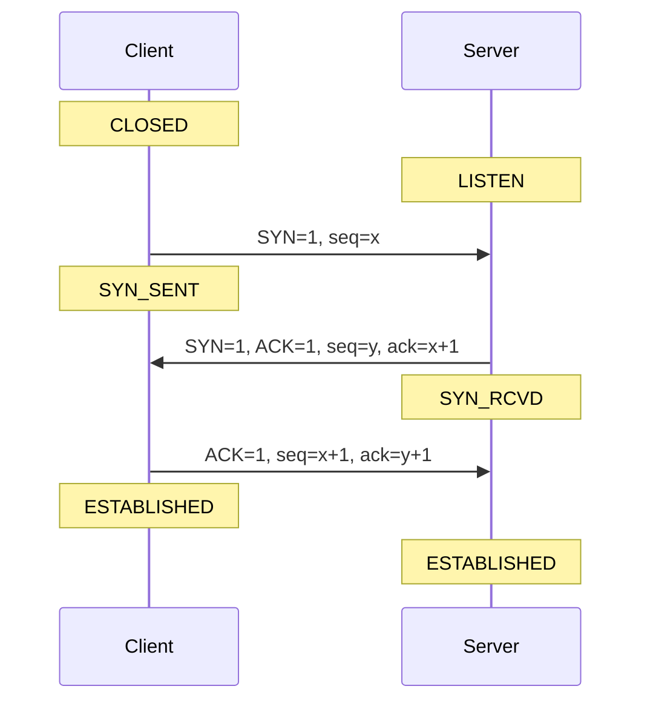
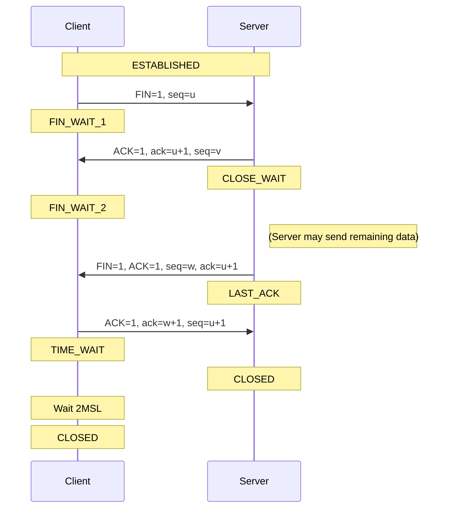

# 第3章 传输层

## 3.1 传输层服务与作用
### 3.1.1 传输层的地位
传输层（transport layer）位于应用层与网络层之间，向应用进程提供端到端的逻辑通信（process-to-process）。网络层提供“主机到主机”的通信，而传输层进一步提供“进程到进程”的通信。

### 3.1.2 传输层的基本动作
- 发送端：把应用报文切分成报文段（segment），加上传输层首部（header），交给网络层。
- 接收端：从网络层取出报文段，检查首部并重组为应用报文。

### 3.1.3 传输层协议
互联网传输层主要有两种协议：
- TCP（Transmission Control Protocol）：可靠、按序、面向连接。
- UDP（User Datagram Protocol）：无连接、尽力而为、开销小。

## 3.2 多路复用与多路分解
### 3.2.1 多路复用（multiplexing）
发送端将来自多个套接字（socket）的数据汇聚，添加传输层首部并形成报文段。

### 3.2.2 多路分解（demultiplexing）
接收端根据首部信息将报文段分发给正确的套接字。

### 3.2.3 UDP 与 TCP 的分解区别
- UDP：仅根据目的 IP 地址与目的端口号进行分解。
- TCP：使用四元组（源 IP、源端口、目的 IP、目的端口）区分连接。

## 3.3 UDP：无连接传输
### 3.3.1 UDP 的特点
- 无连接建立（no handshaking），节省 RTT。
- 无拥塞控制，发送端可按需发送。
- 头部小（8 字节），开销低。
- 不可靠、无序。

### 3.3.2 适用场景
- DNS 查询
- 流媒体（允许丢包）
- SNMP、实时监控

### 3.3.3 UDP 报文段结构
字段包含：源端口、目的端口、长度、校验和、数据。

### 3.3.4 UDP 校验和
校验和采用 1’s complement（反码）求和：
- 发送端对 16 位字求和取反
- 接收端求和验证是否全 1
校验和只用于检测错误，不能纠错，且可能漏检。

## 3.4 可靠数据传输原理（rdt）
### 3.4.1 rdt 的问题背景
真实信道可能出现：比特错误、丢包、乱序。可靠传输需要额外机制保障。

### 3.4.2 rdt1.0：可靠信道
假设无错误无丢包，发送端直接发送，接收端直接交付。

### 3.4.3 rdt2.0：信道有比特错误
加入校验和与 ACK/NAK：
- 接收端校验正确发送 ACK
- 校验失败发送 NAK
- 发送端收到 NAK 重传

问题：ACK/NAK 自身可能被破坏。

### 3.4.4 rdt2.1：序号与重复控制
引入序号（sequence number）：
- 发送端重传时不会造成重复交付
- 接收端识别重复并丢弃

### 3.4.5 rdt2.2：仅用 ACK
不使用 NAK，使用重复 ACK 表示出错或丢包，简化协议。

### 3.4.6 rdt3.0：丢包信道
加入定时器：
- 超时重传
- 停等协议（stop-and-wait）

## 3.5 TCP：可靠传输机制
### 3.5.1 TCP 概述
TCP 提供可靠、按序的字节流服务，连接状态完全保存在端系统中。

### 3.5.2 TCP 报文段结构
关键字段：
- 源端口、目的端口
- 序号（sequence number）
- 确认号（acknowledgement number）
- 窗口大小（rwnd）
- 标志位（SYN、ACK、FIN、RST）
- 校验和、选项

### 3.5.3 序号与确认号
- 序号：报文段数据首字节编号
- 确认号：期望收到的下一个字节编号

TCP 采用累计确认（cumulative ACK）。

### 3.5.4 RTT 估计与超时
SampleRTT：一次往返时间。
EstimatedRTT 使用 EWMA：
EstimatedRTT = (1-α) * EstimatedRTT + α * SampleRTT
DevRTT 用于估计波动：
DevRTT = (1-β) * DevRTT + β * |SampleRTT - EstimatedRTT|
超时值：
TimeoutInterval = EstimatedRTT + 4 * DevRTT

### 3.5.5 TCP 重传机制
- 超时重传：最早未确认段超时后重传
- 快速重传：收到 3 个重复 ACK 立即重传

### 3.5.6 ACK 生成策略
接收端延迟 ACK 以减少开销；对乱序段发送重复 ACK 以触发快速重传。

## 3.6 TCP 连接管理与流量控制
### 3.6.1 流量控制（flow control）
接收端通过接收窗口 rwnd 控制发送端速率：
LastByteSent - LastByteAcked ≤ rwnd
防止接收端缓冲溢出。

### 3.6.2 三次握手（3-way handshake）

TCP 连接建立过程称为“三次握手”，旨在同步双方的初始序列号（ISN）并交换窗口大小等参数。

**交互流程：**

1.  **SYN (Client → Server)**:
    *   客户端随机选择初始序列号 `client_isn`。
    *   设置标志位 `SYN=1`，`seq=client_isn`。
    *   客户端进入 `SYN_SENT` 状态。

2.  **SYN + ACK (Server → Client)**:
    *   服务端收到 SYN，分配缓存和变量。
    *   服务端随机选择初始序列号 `server_isn`。
    *   设置标志位 `SYN=1`，`ACK=1`。
    *   确认号 `ack=client_isn + 1`，序列号 `seq=server_isn`。
    *   服务端进入 `SYN_RCVD` 状态。

3.  **ACK (Client → Server)**:
    *   客户端收到 SYN+ACK，分配缓存和变量。
    *   设置标志位 `ACK=1`，`SYN=0`。
    *   确认号 `ack=server_isn + 1`，序列号 `seq=client_isn + 1`。
    *   此报文段可以携带数据。
    *   双方进入 `ESTABLISHED` 状态。

**时序图：**

> **为什么是三次？**
> *   防止已失效的连接请求报文段突然传送到服务端，导致服务端错误建立连接。
> *   确保双向信道的收发能力都得到确认（Client 发收正常，Server 收发正常）。

### 3.6.3 四次挥手（4-way handshake）

TCP 连接释放过程称为“四次挥手”，因为 TCP 是全双工的，每个方向的连接需要单独关闭。

**交互流程：**

1.  **FIN (Client → Server)**:
    *   客户端应用进程调用关闭，发送连接释放报文。
    *   设置标志位 `FIN=1`，`seq=u`。
    *   客户端进入 `FIN_WAIT_1` 状态，停止发送数据（但可接收）。

2.  **ACK (Server → Client)**:
    *   服务端收到 FIN，发送确认。
    *   设置标志位 `ACK=1`，`ack=u+1`，`seq=v`。
    *   服务端进入 `CLOSE_WAIT` 状态，客户端进入 `FIN_WAIT_2`。
    *   此时处于“半关闭”状态：客户端无数据发送，但服务端仍可发送数据。

3.  **FIN (Server → Client)**:
    *   服务端数据发送完毕，应用进程关闭连接。
    *   设置标志位 `FIN=1`，`ACK=1`，`seq=w`，`ack=u+1`。
    *   服务端进入 `LAST_ACK` 状态。

4.  **ACK (Client → Server)**:
    *   客户端收到 FIN，发送确认。
    *   设置标志位 `ACK=1`，`ack=w+1`，`seq=u+1`。
    *   客户端进入 `TIME_WAIT` 状态，等待 `2MSL` 后关闭。
    *   服务端收到 ACK 后进入 `CLOSED` 状态。

**时序图：**

> **为什么需要 TIME_WAIT (2MSL)？**
> 1.  **保证最后一个 ACK 到达**：如果 ACK 丢失，服务端重传 FIN，客户端需在 TIME_WAIT 中响应重传的 FIN。
> 2.  **防止旧报文干扰**：等待 2MSL 可确保本连接产生的所有报文段都从网络中消失，避免干扰下一个新连接。

## 3.7 拥塞控制与 TCP 拥塞控制
### 3.7.1 拥塞的原因与代价
- 分组排队时延增大
- 丢包引发重传，浪费带宽
- 上游路由器转发资源浪费

### 3.7.2 拥塞控制 vs 流量控制
- 流量控制：保护接收端
- 拥塞控制：保护网络

### 3.7.3 TCP 拥塞控制核心
发送速率 ~ cwnd / RTT，其中 cwnd 为拥塞窗口。

### 3.7.4 AIMD 算法
- 无拥塞：cwnd 线性增加
- 丢包：cwnd 减半

### 3.7.5 慢启动与拥塞避免
- 慢启动（slow start）：cwnd 指数增长
- 拥塞避免（congestion avoidance）：线性增长

### 3.7.6 快速恢复
收到 3 个重复 ACK 后，快速重传并进入快速恢复。
