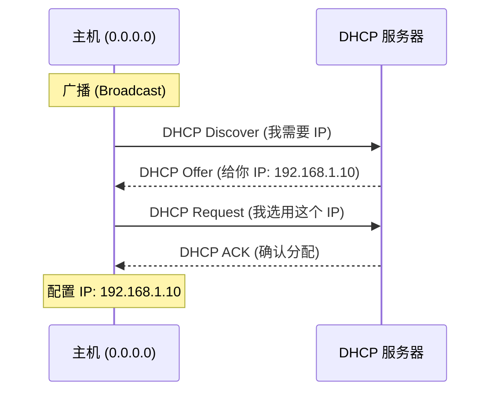
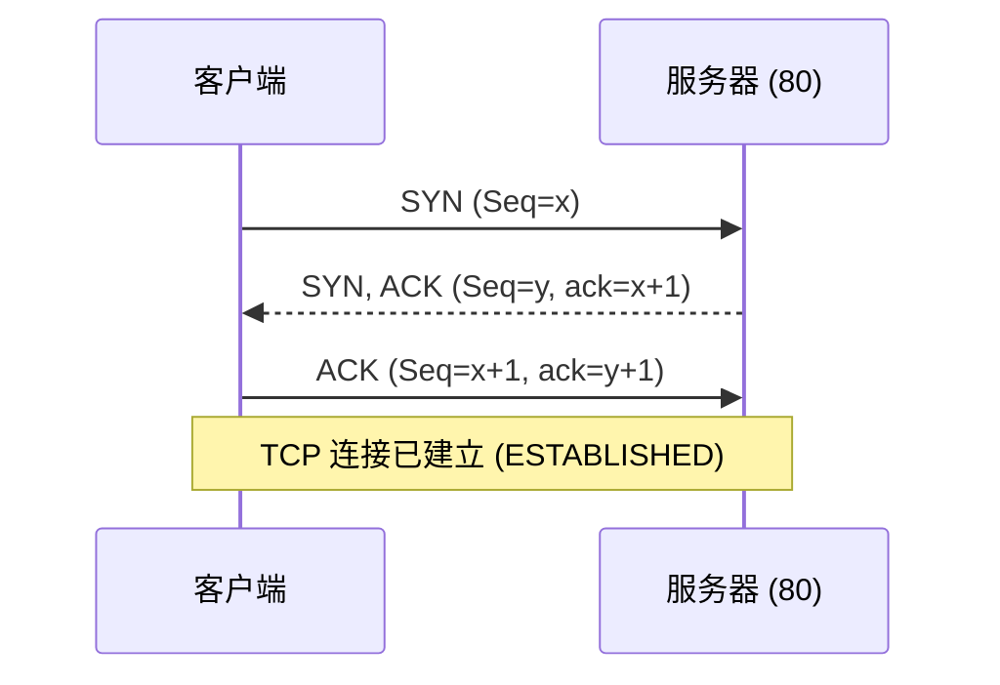
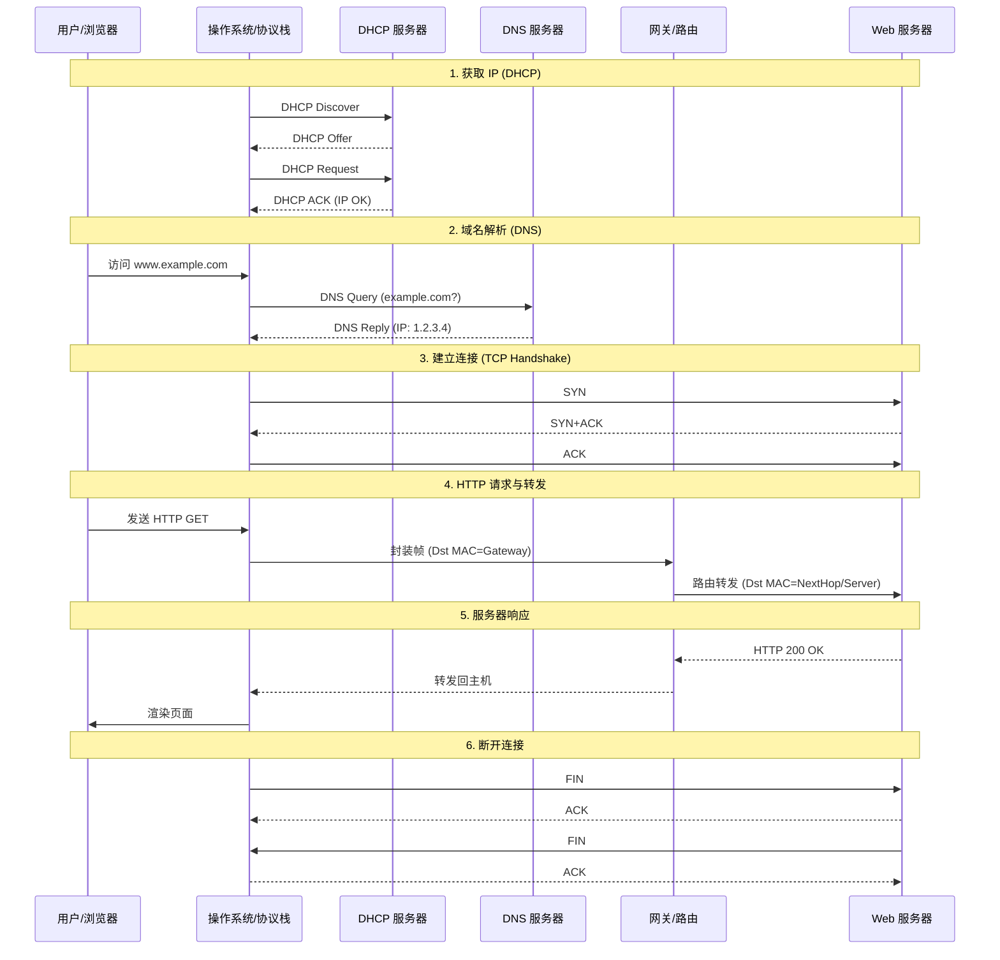

# 第6章 链路层与局域网

## 6.1 链路层概述

### 6.1.1 链路层功能

链路层的核心任务是将**网络层数据报**（Datagram）通过**单个链路**从一个节点传输到物理相邻的下一个节点。其具体功能包括：
1.  **成帧（Framing）**：将网络层数据报封装在**帧**（Frame）中，添加首部和尾部（用于帧定界）。
2.  **链路接入（Link Access）**：媒体访问控制（MAC）协议规定了帧如何在链路上传输。对于共享介质（如 WiFi、早期以太网），MAC 协议负责协调发送以避免碰撞。
3.  **可靠交付（Reliable Delivery）**：通过确认和重传机制，保证数据报在链路上的无差错传输。通常用于高误码率链路（如无线链路），而在低误码率链路（如光纤、双绞线）上通常不提供此服务以减少开销。
4.  **差错检测与纠正（Error Detection and Correction）**：检测信号衰减或噪声引入的比特错误。
    *   **检测**：接收方检测到错误后丢弃帧或请求重传。
    *   **纠正**：接收方直接定位并纠正错误比特。

### 6.1.2 数据单元
- **帧（Frame）**：链路层的协议数据单元。
链路层帧将网络层的数据报（Packet）封装在核心载荷部分，并添加必要的首部（Header）和尾部（Trailer）。
**帧的典型结构**包含以下字段：
```viz
digraph FrameStructure {
  rankdir=TB;
  node [shape=none, fontname="Helvetica"];
  bgcolor="transparent";

  frame [label=<
  <table border="0" cellborder="1" cellspacing="0" cellpadding="10">
    <tr>
      <td bgcolor="#f5f5f5" width="60"><b>Preamble</b></td>
      <td bgcolor="#e0e0e0" width="80"><b>Dest MAC</b></td>
      <td bgcolor="#e0e0e0" width="80"><b>Source MAC</b></td>
      <td bgcolor="#f5f5f5" width="50"><b>Type</b></td>
      <td bgcolor="#ffffff" width="180"><b>Data (Payload)</b></td>
      <td bgcolor="#f5f5f5" width="50"><b>CRC</b></td>
    </tr>
    <tr>
      <td align="center"><font point-size="10" color="#666666">8 字节<br/>帧定界/同步</font></td>
      <td align="center"><font point-size="10" color="#666666">6 字节<br/>目标地址</font></td>
      <td align="center"><font point-size="10" color="#666666">6 字节<br/>源地址</font></td>
      <td align="center"><font point-size="10" color="#666666">2 字节<br/>上层协议</font></td>
      <td align="center"><font point-size="10" color="#666666">46-1500 字节<br/>网络层数据报</font></td>
      <td align="center"><font point-size="10" color="#666666">4 字节<br/>差错检测</font></td>
    </tr>
  </table>
  >];
}
```
1.  **帧定界符（Frame Delimiter）**：用于指示帧的开始和结束（如前导码）。
2.  **地址字段（Address）**：源 MAC 地址和目的 MAC 地址，用于在局域网内标识发送方和接收方。
3.  **类型字段（Type）**：指出上层协议类型（如 IPv4, IPv6, ARP）。
4.  **数据字段（Payload）**：承载的网络层数据报（最大传输单元 MTU 限制了其长度，如以太网默认为 1500 字节）。
5.  **差错检测位（Error Check）**：通常是 CRC 校验码，用于检测传输过程中的比特错误。

### 6.1.3 链路层服务
主要包括：成帧、链路接入、可靠交付、流量控制、差错检测、差错纠正、半双工/全双工通信支持。

### 6.1.4 实现位置
- **网络适配器（网卡 NIC）**：链路层的主体实现位置。
- **软硬件结合**：核心控制器（硬件）处理成帧、MAC 协议、差错检测等；驱动程序（软件）处理配置和中断。

## 6.2 差错检测与纠正
在不可靠的链路上，比特差错是常态。链路层通过添加冗余信息（EDC, Error Detection and Correction bits）来检测或纠正错误。

### 6.2.1 奇偶校验（Parity Check）
最简单的检错方法，分为奇校验和偶校验。
*   **单比特偶校验（Even Parity）**：
    *   **规则**：发送方在数据后附加 1 个校验位，使得整个帧（数据+校验位）中“1”的个数为**偶数**。
    *   **例子**：
        *   数据：`1011 0101` (5个1)
        *   校验位：`1` (使得总共有6个1)
        *   发送：`1011 0101 1`
    *   **能力**：能检测出奇数个比特错误，但无法检测偶数个比特错误（如2个位同时反转），且无法定位错误位置。

*   **二维奇偶校验（2D Parity）**：
    *   **规则**：将数据排列成矩阵，对每一行和每一列分别计算奇偶校验位。
    *   **能力**：不仅能检测错误，还能利用行列交点**定位并纠正**单比特错误。

### 6.2.2 Internet 校验和（Checksum）
常用于传输层（UDP/TCP）和网络层（IP），但原理属于通用的检错技术。
*   **计算步骤**（发送方）：
    1.  将数据划分为 16 位的序列。
    2.  将所有 16 位序列进行**二进制反码求和**（1's complement sum）。即：常规二进制加法，若最高位有进位，则将进位加到最低位。
    3.  对最终结果取反，得到校验和。
*   **例子**：
    *   数据：`10111011 10110101` (Word 1) 和 `10001111 00001100` (Word 2)
    *   求和：
        ```
          10111011 10110101
        + 10001111 00001100
        -------------------
        1 01001010 11000001  (溢出 1)
          01001010 11000001
        +                 1  (回卷加 1)
        -------------------
          01001010 11000010
        ```
    *   取反：`10110101 00111101` (这就是校验和)
*   **接收方**：将所有数据（包括校验和）相加，结果若全为 1，则无错。

### 6.2.3 循环冗余检测（CRC）
链路层最广泛使用的检错技术（如以太网、WiFi）。基于多项式除法。
*   **原理**：
    *   发送方和接收方协商一个**生成多项式 G**（$r+1$ 位）。
    *   对于数据 **D**，发送方计算一个 $r$ 位的 **R**（FCS，帧检验序列），使得拼接后的 $D \cdot 2^r + R$ 能被 $G$ 整除（模 2 运算）。
    *   **模 2 运算**：加法和减法都不借位/进位，等同于 **XOR**（异或）。
*   **计算 R 的例子**：
    *   假设数据 $D = 101110$
    *   生成多项式 $G = 1001$ ($r=3$ 位)
    *   **步骤**：
        1.  $D$ 左移 $r$ 位：$101110 \to 101110\mathbf{000}$
        2.  用 $101110000$ 除以 $1001$（模 2 除法）：
            ```
                  101011  (商，不重要)
                __________
            1001 ) 101110000
                   1001
                   ----
                    0101
                    0000
                    ----
                     1010
                     1001
                     ----
                      0110
                      0000
                      ----
                       1100
                       1001
                       ----
                        1010
                        1001
                        ----
                         011 (余数 R)
            ```
        3.  得到 $R = 011$。
        4.  发送帧：$101110\mathbf{011}$。
*   **接收方**：用收到的数据除以 $G$，若余数为 0 则无错，否则有错。
*   **特点**：能检测所有突发长度小于 $r+1$ 的错误，检错能力极强，易于硬件实现。

## 6.3 多路访问协议
### 6.3.1 多路访问的含义
在广播链路（Broadcast Link）中，多个节点共享同一个传输介质（如早期同轴电缆以太网、WiFi）。当两个或多个节点同时发送帧时，信号会在介质上叠加，导致**碰撞**（Collision），使得接收方无法正确解码。
**多路访问控制协议**（MAC Protocol）就是一种分布式算法，用于协调多个节点的发送行为，以避免碰撞或在碰撞后恢复。

### 6.3.2 协议分类（3类）
MAC 协议主要分为以下三类：
1.  **信道划分协议（Channel Partitioning Protocols）**：静态划分信道资源（时间、频率、码片），适合高负载。
2.  **随机接入协议（Random Access Protocols）**：节点争用信道，发生碰撞后重传，适合突发低负载。
3.  **轮流协议（Taking-Turns Protocols）**：节点轮流发送，结合了前两者的优点。

### 6.3.3 信道划分协议（重点）
这类协议通过严格划分资源来避免碰撞。
*   **TDMA（时分多路访问）**：将时间划分为帧，每帧划分为 N 个时隙，每个节点固定分配一个时隙。
    *   优点：无碰撞，公平。
    *   缺点：低负载时效率低（节点不发数据时，时隙浪费），需严格时钟同步。
*   **FDMA（频分多路访问）**：将频谱划分为 N 个频带，每个节点分配一个专用频带。
    *   优点：无碰撞。
    *   缺点：频带闲置时浪费资源。
*   **CDMA（码分多路访问）**：每个节点分配唯一的编码序列（Code），允许同时发送，接收方通过解码分离信号（主要用于无线网络）。

### 6.3.4 随机接入协议
节点有帧就发，不预先分配资源。
1.  **ALOHA**：最原始的协议，想发就发。若无 ACK 则重传。效率极低。
2.  **时隙 ALOHA（Slotted ALOHA）**：将时间分片，节点只能在时隙开始时发送。效率比纯 ALOHA 翻倍，但仍有空闲和碰撞。
3.  **CSMA（载波侦听多路访问）**：
    *   **“说话前先听”**（Listen before talk）：发送前侦听信道，若忙则等待，若闲则发送。
    *   仍然会有碰撞：因为**传播延迟**（Propagation Delay），节点 A 发出的信号还没到达 B，B 以为信道空闲也发送。
4.  **CSMA/CD（碰撞检测）（重点）**：
    *   **工作原理**：
        1.  **侦听**：发送前侦听信道，若忙则等待，若闲则发送。
        2.  **发送并检测**：边发送边检测信号电压（**Listen while talk**）。
        3.  **碰撞处理**：若检测到碰撞，**立即停止发送**（不再浪费时间发完整个帧），并发送人为干扰信号（Jamming Signal）通知所有节点。
        4.  **退避**：进入**二进制指数退避**（Binary Exponential Backoff）算法，计算随机等待时间后重试。
    *   **核心优势**：相比 CSMA，大幅减少了碰撞持续时间，提高了信道利用率。
    *   **应用**：经典有线以太网。

### 6.3.5 轮流协议（重点）
试图结合随机接入（低负载延迟低）和信道划分（高负载无碰撞）的优点。
1.  **轮询协议（Polling）**：
    *   有一个主节点（Master）依次询问从节点（Slave）是否有数据发送。
    *   **优点**：无碰撞，无空闲时隙浪费，利用率高。
    *   **缺点**：轮询开销（Polling overhead），延迟（需等主节点问到），单点故障风险（主节点挂了全网瘫痪）。
2.  **令牌传递协议（Token Passing）**：
    *   一个特殊的控制帧“令牌”（Token）在节点间按顺序传递。
    *   持有令牌的节点才能发送数据，发完后将令牌传给下一个。
    *   **优点**：无碰撞，效率高，去中心化。
    *   **缺点**：令牌丢失需复杂恢复机制，节点故障可能中断环。

## 6.4 以太网与交换机
### 6.4.1 以太网特性
以太网（Ethernet）是最常见的有线 LAN 技术：
- 无连接、尽力而为
- 早期共享介质采用 CSMA/CD
- 现代交换式以太网全双工，无碰撞

### 6.4.2 以太网帧结构
字段包含前同步码、帧开始定界符、目的/源 MAC、类型、数据、CRC。

### 6.4.3 交换机工作原理
- 存储转发（store-and-forward）
- 学习源 MAC 建立转发表（self-learning）
- 根据目的 MAC 转发或过滤

### 6.4.4 交换机与路由器对比
- 交换机：链路层设备，基于 MAC 地址转发。
- 路由器：网络层设备，基于 IP 地址转发。
交换机易产生广播风暴，路由器可隔离广播域。

## 6.5 MAC 地址与 ARP
### 6.5.1 MAC 地址
MAC 地址（LAN address）为 48 位物理地址，标识网络接口。

### 6.5.2 ARP 协议
ARP（Address Resolution Protocol）将 IP 映射为 MAC：
- 查询使用广播
- 响应使用单播

### 6.5.3 ARP 表
ARP 表保存（IP，MAC，TTL）映射，缓存提高效率。

### 6.5.4 跨网段转发
若目的地址不在本子网，帧目的 MAC 为默认网关接口 MAC，由路由器转发。

## 6.6 VLAN 与 802.1Q
### 6.6.1 VLAN 动机
- 缩小广播域
- 逻辑隔离不同部门
- 支持用户迁移

### 6.6.2 VLAN 类型
- 端口 VLAN：按端口划分
- 动态 VLAN：按 MAC 动态分配

### 6.6.3 VLAN 间通信
不同 VLAN 之间通信需要路由器或三层交换机。

### 6.6.4 802.1Q
802.1Q 帧中插入 VLAN Tag：
- 12 位 VLAN ID
- 优先级字段
用于 trunk 端口在多交换机间转发。

## 6.7 综合示例：Web 页面请求的历程

假设用户在浏览器输入 `www.example.com`，以下是计算机网络各层协议协同工作的完整过程。

### 6.7.1 第一步：获取本机 IP 地址（DHCP）
主机启动或接入网络时，需要获取 IP 地址、子网掩码、默认网关和 DNS 服务器地址。
1.  **DHCP Discover**：主机广播发现报文（UDP，源端口68，目的端口67，目的 IP 255.255.255.255）。
2.  **DHCP Offer**：DHCP 服务器收到广播，分配 IP，单播或广播回复 Offer。
3.  **DHCP Request**：主机选择一个 Offer，广播请求报文（确认使用该 IP）。
4.  **DHCP ACK**：服务器确认，主机完成配置。



### 6.7.2 第二步：域名解析（DNS）
主机需要将域名 `www.example.com` 解析为 IP 地址。
1.  主机向**本地 DNS 服务器**发送 DNS 查询报文（UDP，端口 53）。
2.  若本地 DNS 无缓存，则进行迭代查询：
    *   向**根 DNS** 查询，获得 `.com` 顶级域 DNS 地址。
    *   向 **TLD DNS** 查询，获得 `example.com` 权威 DNS 地址。
    *   向**权威 DNS** 查询，获得 `www.example.com` 的 IP 地址。
3.  本地 DNS 将结果缓存并返回给主机。

```viz
digraph DNS {
  rankdir=LR;
  node [shape=box, fontname="Helvetica"];
  bgcolor="transparent";
  
  Client [label="主机"];
  LocalDNS [label="本地 DNS\n(ISP)"];
  Root [label="根 DNS\n(.)"];
  TLD [label="顶级域 DNS\n(.com)"];
  Auth [label="权威 DNS\n(example.com)"];
  
  Client -> LocalDNS [label="1. 查询 www.example.com"];
  LocalDNS -> Root [label="2. 问根"];
  Root -> LocalDNS [label="3. 找 .com DNS"];
  LocalDNS -> TLD [label="4. 问 .com"];
  TLD -> LocalDNS [label="5. 找 example.com DNS"];
  LocalDNS -> Auth [label="6. 问 example.com"];
  Auth -> LocalDNS [label="7. 返回 IP"];
  LocalDNS -> Client [label="8. 返回 IP"];
}
```

### 6.7.3 第三步：建立 TCP 连接（三次握手）
获得服务器 IP 后，主机与服务器的 Web 服务端口（80）建立可靠连接。
1.  **SYN**：客户端发送 SYN=1, Seq=x。
2.  **SYN+ACK**：服务器回复 SYN=1, ACK=1, ack=x+1, Seq=y。
3.  **ACK**：客户端回复 ACK=1, ack=y+1, Seq=x+1。连接建立。



### 6.7.4 第四步：发送 HTTP 请求与封装
客户端构造 HTTP GET 请求报文，并自上而下封装。
1.  **应用层**：HTTP 报文。
2.  **传输层**：添加 TCP 首部（源/目端口）。
3.  **网络层**：添加 IP 首部（源/目 IP）。
4.  **链路层**：添加以太网帧首部（源/目 MAC）和尾部（CRC）。
    *   **ARP**：如果目的 IP 不在同一网段，目的 MAC 应为**默认网关**的 MAC。若 ARP 表中无网关 MAC，需先广播 **ARP Request** 获取。

```viz
digraph Encapsulation {
  rankdir=TD;
  node [shape=record, fontname="Helvetica"];
  bgcolor="transparent";
  
  subgraph cluster_packet {
    label="链路层帧 (Frame)";
    style=dashed;
    
    frame [label="{ <eth> Eth Header | <ip> IP Header | <tcp> TCP Header | <http> HTTP Request | <crc> CRC }"];
  }
  
  details [shape=plaintext, label=<<TABLE BORDER="0" CELLBORDER="1" CELLSPACING="0">
    <TR><TD>Eth Header</TD><TD>Dest MAC: Gateway MAC<BR/>Source MAC: Host MAC</TD></TR>
    <TR><TD>IP Header</TD><TD>Dest IP: Server IP<BR/>Source IP: Host IP</TD></TR>
    <TR><TD>TCP Header</TD><TD>Dest Port: 80<BR/>Source Port: Random</TD></TR>
  </TABLE>>];
  
  frame:eth -> details;
}
```

### 6.7.5 第五步：路由转发
帧离开主机，到达默认网关（路由器）。
1.  **解封装**：路由器提取 IP 数据报。
2.  **查表**：根据目的 IP 查找转发表，确定下一跳接口。
3.  **重封装**：封装新的以太网帧。
    *   **源 MAC**：路由器出接口 MAC。
    *   **目的 MAC**：下一跳路由器或服务器 MAC（需 ARP）。
    *   **TTL**：减 1。

```viz
digraph Routing {
  rankdir=LR;
  node [shape=ellipse, fontname="Helvetica"];
  edge [fontname="Helvetica", fontsize=10];
  bgcolor="transparent";
  
  Host [label="主机\nIP_A, MAC_A"];
  Router [label="路由器\nMAC_R_in | MAC_R_out", shape=record];
  Server [label="服务器\nIP_B, MAC_B"];
  
  Host -> Router [label="Frame 1\nSrc: MAC_A\nDst: MAC_R_in\nIP Src: A, Dst: B"];
  Router -> Server [label="Frame 2\nSrc: MAC_R_out\nDst: MAC_B\nIP Src: A, Dst: B"];
}
```

### 6.7.6 第六步：服务器处理并响应
1.  服务器收到帧，逐层解封装得到 HTTP 请求。
2.  Web 服务器软件处理请求（读取文件、运行脚本等）。
3.  构建 HTTP 响应（200 OK），并沿原路（逻辑路径）返回给客户端。

### 6.7.7 第七步：释放 TCP 连接（四次挥手）
数据传输完成后，释放连接。
1.  Client 发送 **FIN**。
2.  Server 回复 **ACK**（Client 半关闭）。
3.  Server 发送 **FIN**。
4.  Client 回复 **ACK**，进入 TIME_WAIT。

### 6.7.8 完整流程总结


应用数据 → 传输层段 → IP 数据报 → 以太网帧，经交换机送到路由器。
