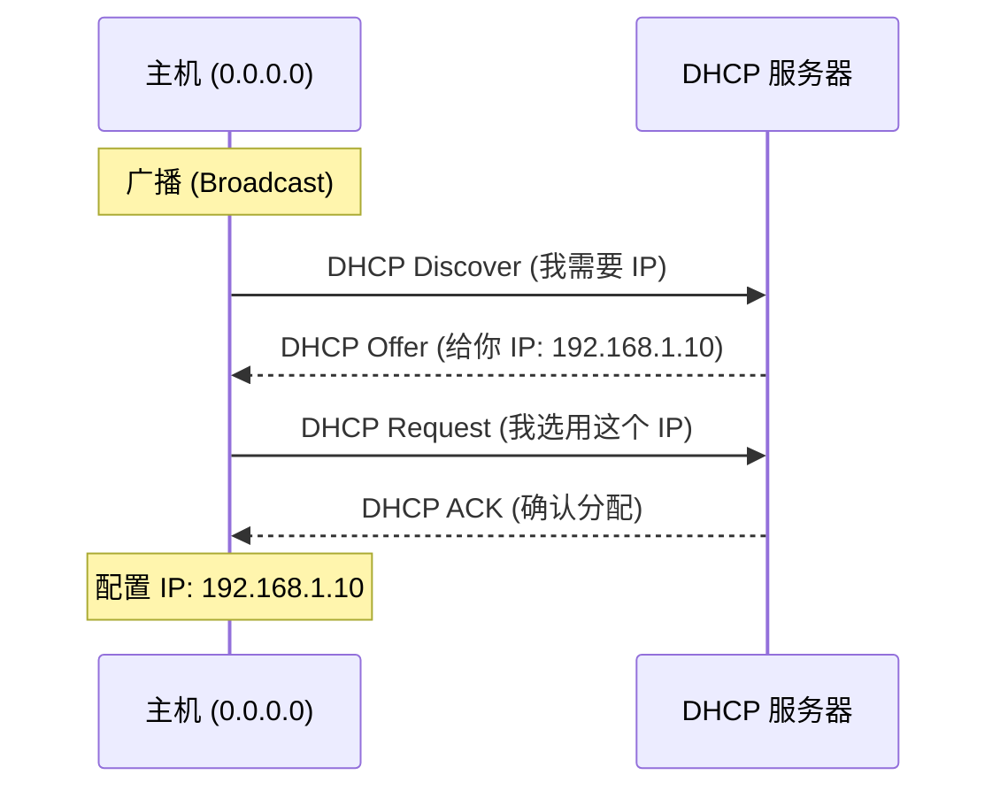
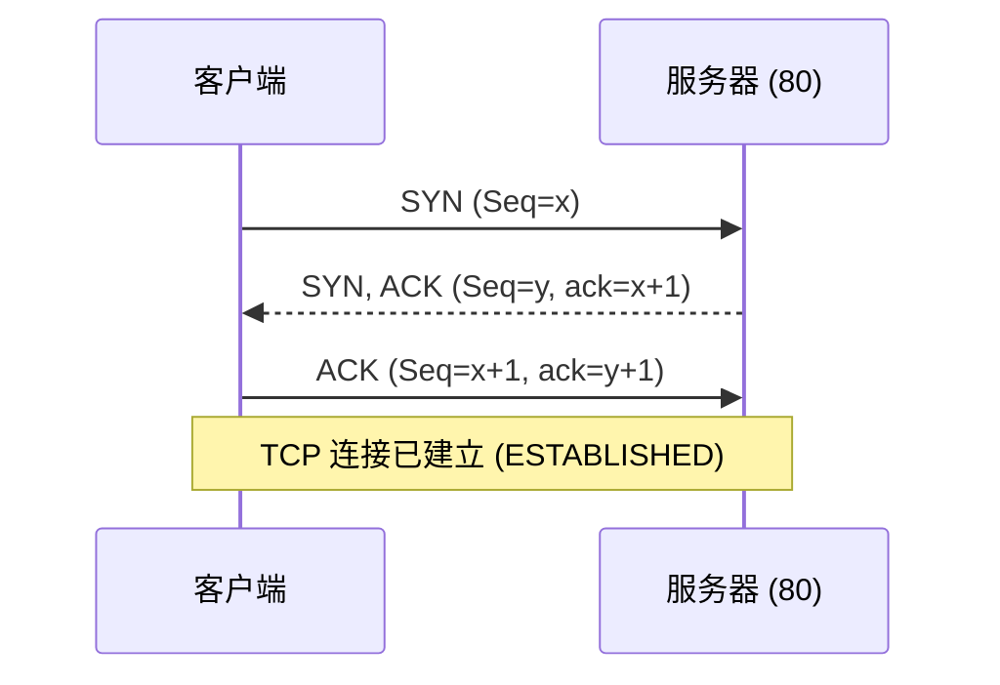
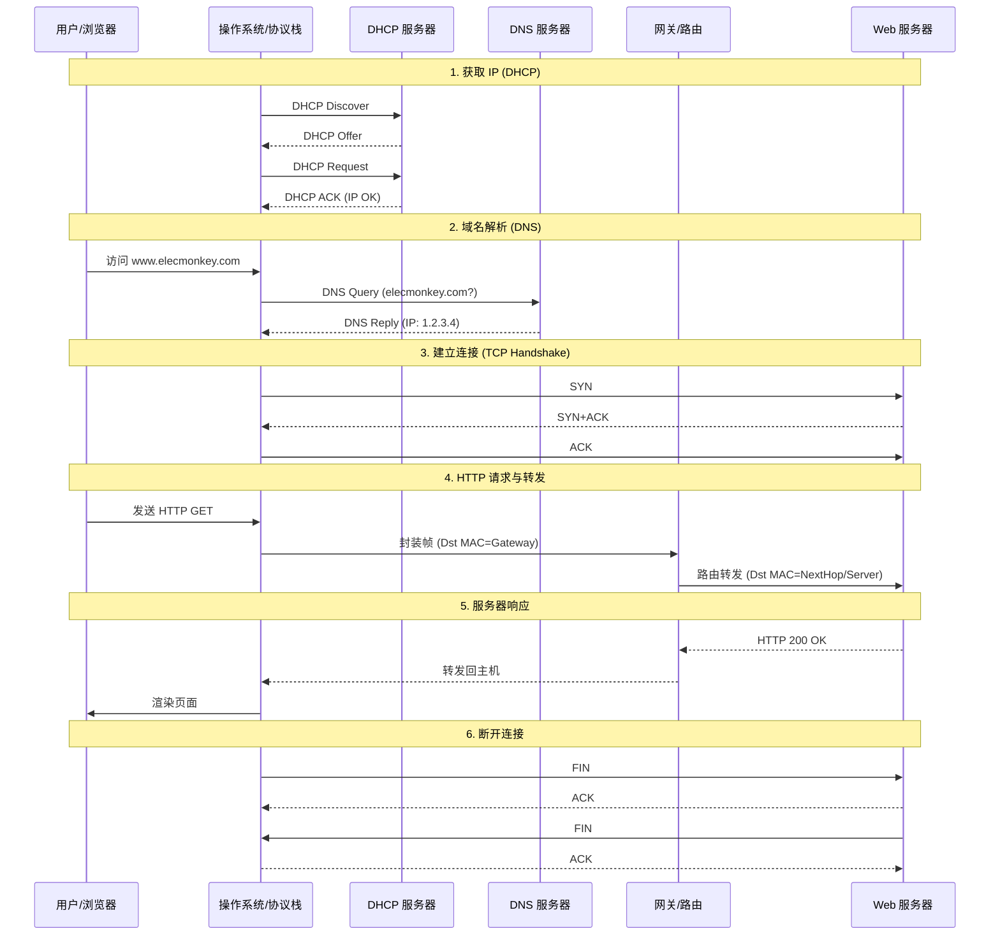

# 第6章 链路层与局域网

## 6.1 链路层概述

### 6.1.1 链路层功能

链路层的核心任务是将**网络层数据报**（Datagram）通过**单个链路**从一个节点传输到物理相邻的下一个节点。其具体功能包括：
1.  **成帧（Framing）**：将网络层数据报封装在**帧**（Frame）中，添加首部和尾部（用于帧定界）。
2.  **链路接入（Link Access）**：媒体访问控制（MAC）协议规定了帧如何在链路上传输。对于共享介质（如 WiFi、早期以太网），MAC 协议负责协调发送以避免碰撞。
3.  **可靠交付（Reliable Delivery）**：通过确认和重传机制，保证数据报在链路上的无差错传输。通常用于高误码率链路（如无线链路），而在低误码率链路（如光纤、双绞线）上通常不提供此服务以减少开销。
4.  **差错检测与纠正（Error Detection and Correction）**：检测信号衰减或噪声引入的比特错误。
    *   **检测**：接收方检测到错误后丢弃帧或请求重传。
    *   **纠正**：接收方直接定位并纠正错误比特。

### 6.1.2 数据单元
- **帧（Frame）**：链路层的协议数据单元。
链路层帧将网络层的数据报（Packet）封装在核心载荷部分，并添加必要的首部（Header）和尾部（Trailer）。
**帧的典型结构**包含以下字段：
```viz
digraph FrameStructure {
  rankdir=TB;
  node [shape=none, fontname="Helvetica"];
  bgcolor="transparent";

  frame [label=<
  <table border="0" cellborder="1" cellspacing="0" cellpadding="10">
    <tr>
      <td bgcolor="#f5f5f5" width="60"><b>Preamble</b></td>
      <td bgcolor="#e0e0e0" width="80"><b>Dest MAC</b></td>
      <td bgcolor="#e0e0e0" width="80"><b>Source MAC</b></td>
      <td bgcolor="#f5f5f5" width="50"><b>Type</b></td>
      <td bgcolor="#ffffff" width="180"><b>Data (Payload)</b></td>
      <td bgcolor="#f5f5f5" width="50"><b>CRC</b></td>
    </tr>
    <tr>
      <td align="center"><font point-size="10" color="#666666">8 字节<br/>帧定界/同步</font></td>
      <td align="center"><font point-size="10" color="#666666">6 字节<br/>目标地址</font></td>
      <td align="center"><font point-size="10" color="#666666">6 字节<br/>源地址</font></td>
      <td align="center"><font point-size="10" color="#666666">2 字节<br/>上层协议</font></td>
      <td align="center"><font point-size="10" color="#666666">46-1500 字节<br/>网络层数据报</font></td>
      <td align="center"><font point-size="10" color="#666666">4 字节<br/>差错检测</font></td>
    </tr>
  </table>
  >];
}
```
1.  **帧定界符（Frame Delimiter）**：用于指示帧的开始和结束（如前导码）。
2.  **地址字段（Address）**：源 MAC 地址和目的 MAC 地址，用于在局域网内标识发送方和接收方。
3.  **类型字段（Type）**：指出上层协议类型（如 IPv4, IPv6, ARP）。
4.  **数据字段（Payload）**：承载的网络层数据报（最大传输单元 MTU 限制了其长度，如以太网默认为 1500 字节）。
5.  **差错检测位（Error Check）**：通常是 CRC 校验码，用于检测传输过程中的比特错误。

### 6.1.3 链路层服务
主要包括：成帧、链路接入、可靠交付、流量控制、差错检测、差错纠正、半双工/全双工通信支持。

### 6.1.4 实现位置
- **网络适配器（网卡 NIC）**：链路层的主体实现位置。
- **软硬件结合**：核心控制器（硬件）处理成帧、MAC 协议、差错检测等；驱动程序（软件）处理配置和中断。

## 6.2 差错检测与纠正
在不可靠的链路上，比特差错是常态。链路层通过添加冗余信息（EDC, Error Detection and Correction bits）来检测或纠正错误。

### 6.2.1 奇偶校验（Parity Check）
最简单的检错方法，分为奇校验和偶校验。
*   **单比特偶校验（Even Parity）**：
    *   **规则**：发送方在数据后附加 1 个校验位，使得整个帧（数据+校验位）中“1”的个数为**偶数**。
    *   **例子**：
        *   数据：`1011 0101` (5个1)
        *   校验位：`1` (使得总共有6个1)
        *   发送：`1011 0101 1`
    *   **能力**：能检测出奇数个比特错误，但无法检测偶数个比特错误（如2个位同时反转），且无法定位错误位置。

*   **二维奇偶校验（2D Parity）**：
    *   **规则**：将数据排列成矩阵，对每一行和每一列分别计算奇偶校验位。
    *   **能力**：不仅能检测错误，还能利用行列交点**定位并纠正**单比特错误。

### 6.2.2 Internet 校验和（Checksum）
常用于传输层（UDP/TCP）和网络层（IP），但原理属于通用的检错技术。
*   **计算步骤**（发送方）：
    1.  将数据划分为 16 位的序列。
    2.  将所有 16 位序列进行**二进制反码求和**（1's complement sum）。即：常规二进制加法，若最高位有进位，则将进位加到最低位。
    3.  对最终结果取反，得到校验和。
*   **例子**：
    *   数据：`10111011 10110101` (Word 1) 和 `10001111 00001100` (Word 2)
    *   求和：
        ```
          10111011 10110101
        + 10001111 00001100
        -------------------
        1 01001010 11000001  (溢出 1)
          01001010 11000001
        +                 1  (回卷加 1)
        -------------------
          01001010 11000010
        ```
    *   取反：`10110101 00111101` (这就是校验和)
*   **接收方**：将所有数据（包括校验和）相加，结果若全为 1，则无错。

### 6.2.3 循环冗余检测（CRC）
链路层最广泛使用的检错技术（如以太网、WiFi）。基于多项式除法。
*   **原理**：
    *   发送方和接收方协商一个**生成多项式 G**（$r+1$ 位）。
    *   对于数据 **D**，发送方计算一个 $r$ 位的 **R**（FCS，帧检验序列），使得拼接后的 $D \cdot 2^r + R$ 能被 $G$ 整除（模 2 运算）。
    *   **模 2 运算**：加法和减法都不借位/进位，等同于 **XOR**（异或）。
*   **计算 R 的例子**：
    *   假设数据 $D = 101110$
    *   生成多项式 $G = 1001$ ($r=3$ 位)
    *   **步骤**：
        1.  $D$ 左移 $r$ 位：$101110 \to 101110\mathbf{000}$
        2.  用 $101110000$ 除以 $1001$（模 2 除法）：
            ```
                  101011  (商，不重要)
                __________
            1001 ) 101110000
                   1001
                   ----
                    0101
                    0000
                    ----
                     1010
                     1001
                     ----
                      0110
                      0000
                      ----
                       1100
                       1001
                       ----
                        1010
                        1001
                        ----
                         011 (余数 R)
            ```
        3.  得到 $R = 011$。
        4.  发送帧：$101110\mathbf{011}$。
*   **接收方**：用收到的数据除以 $G$，若余数为 0 则无错，否则有错。
*   **特点**：能检测所有突发长度小于 $r+1$ 的错误，检错能力极强，易于硬件实现。

## 6.3 多路访问协议
### 6.3.1 多路访问的含义
在广播链路（Broadcast Link）中，多个节点共享同一个传输介质（如早期同轴电缆以太网、WiFi）。当两个或多个节点同时发送帧时，信号会在介质上叠加，导致**碰撞**（Collision），使得接收方无法正确解码。
**多路访问控制协议**（MAC Protocol）就是一种分布式算法，用于协调多个节点的发送行为，以避免碰撞或在碰撞后恢复。

### 6.3.2 协议分类（3类）
MAC 协议主要分为以下三类：
1.  **信道划分协议（Channel Partitioning Protocols）**：静态划分信道资源（时间、频率、码片），适合高负载。
2.  **随机接入协议（Random Access Protocols）**：节点争用信道，发生碰撞后重传，适合突发低负载。
3.  **轮流协议（Taking-Turns Protocols）**：节点轮流发送，结合了前两者的优点。

### 6.3.3 信道划分协议（重点）
这类协议通过严格划分资源来避免碰撞。
*   **TDMA（时分多路访问）**：将时间划分为帧，每帧划分为 N 个时隙，每个节点固定分配一个时隙。
    *   优点：无碰撞，公平。
    *   缺点：低负载时效率低（节点不发数据时，时隙浪费），需严格时钟同步。
*   **FDMA（频分多路访问）**：将频谱划分为 N 个频带，每个节点分配一个专用频带。
    *   优点：无碰撞。
    *   缺点：频带闲置时浪费资源。
*   **CDMA（码分多路访问）**：每个节点分配唯一的编码序列（Code），允许同时发送，接收方通过解码分离信号（主要用于无线网络）。

### 6.3.4 随机接入协议
节点有帧就发，不预先分配资源。
1.  **ALOHA**：最原始的协议，想发就发。若无 ACK 则重传。效率极低。
2.  **时隙 ALOHA（Slotted ALOHA）**：将时间分片，节点只能在时隙开始时发送。效率比纯 ALOHA 翻倍，但仍有空闲和碰撞。
3.  **CSMA（载波侦听多路访问）**：
    *   **“说话前先听”**（Listen before talk）：发送前侦听信道，若忙则等待，若闲则发送。
    *   仍然会有碰撞：因为**传播延迟**（Propagation Delay），节点 A 发出的信号还没到达 B，B 以为信道空闲也发送。
4.  **CSMA/CD（碰撞检测）（重点）**：
    *   **工作原理**：
        1.  **侦听**：发送前侦听信道，若忙则等待，若闲则发送。
        2.  **发送并检测**：边发送边检测信号电压（**Listen while talk**）。
        3.  **碰撞处理**：若检测到碰撞，**立即停止发送**（不再浪费时间发完整个帧），并发送人为干扰信号（Jamming Signal）通知所有节点。
        4.  **退避**：进入**二进制指数退避**（Binary Exponential Backoff）算法，计算随机等待时间后重试。
    *   **核心优势**：相比 CSMA，大幅减少了碰撞持续时间，提高了信道利用率。
    *   **应用**：经典有线以太网。

<VisualizationLink
  title="CSMA/CD 协议工作原理"
  href="/computer-networking/visualization/csma-cd-protocol"
  desc="交互式模拟以太网的载波侦听、碰撞检测、干扰信号广播及二进制指数退避过程。"
/>


### 6.3.5 轮流协议（重点）
试图结合随机接入（低负载延迟低）和信道划分（高负载无碰撞）的优点。
1.  **轮询协议（Polling）**：
    *   有一个主节点（Master）依次询问从节点（Slave）是否有数据发送。
    *   **优点**：无碰撞，无空闲时隙浪费，利用率高。
    *   **缺点**：轮询开销（Polling overhead），延迟（需等主节点问到），单点故障风险（主节点挂了全网瘫痪）。
2.  **令牌传递协议（Token Passing）**：
    *   一个特殊的控制帧“令牌”（Token）在节点间按顺序传递。
    *   持有令牌的节点才能发送数据，发完后将令牌传给下一个。
    *   **优点**：无碰撞，效率高，去中心化。
    *   **缺点**：令牌丢失需复杂恢复机制，节点故障可能中断环。

## 6.4 局域网 (LAN) 与以太网

### 6.4.1 局域网概述
**局域网 (Local Area Network, LAN)** 是指在较小的地理范围内（如家庭、学校、办公楼），将各种计算机、外设和数据库系统互联起来的计算机网络。

*   **特点**：
    1.  **范围小**：通常几公里以内。
    2.  **速率高**：从早期的 10Mbps 到现在的 100Gbps。
    3.  **误码率低**：使用优质传输介质（双绞线、光纤），误码率极低。
    4.  **广播信道**：传统 LAN 多采用共享信道，支持广播和组播。

*   **体系结构 (IEEE 802 标准)**：
    为了使数据链路层能更好地适应多种局域网标准，IEEE 802 委员会将链路层拆分为两个子层：
    1.  **逻辑链路控制子层 (LLC, Logical Link Control)**：
        *   **上层**子层。
        *   向网络层提供统一的接口，隐藏不同物理网络的差异。
        *   负责帧的序号管理、流量控制和差错控制（在现代 TCP/IP 栈中，LLC 的功能多被上层协议接管，变得透明或简化）。
    2.  **媒体访问控制子层 (MAC, Media Access Control)**：
        *   **下层**子层，直接与物理层交互。
        *   负责**组帧**、**寻址**（MAC 地址）和**多路访问控制**（如 CSMA/CD）。
        *   不同的 LAN 技术（以太网、WiFi）主要区别在于 MAC 子层和物理层。

### 6.4.2 以太网特性
以太网（Ethernet）是目前最主流的有线 LAN 技术：
- **无连接 (Connectionless)**：发送方和接收方之间不进行握手。
- **不可靠 (Unreliable)**：不向发送方确认，差错帧直接丢弃（依靠高层 TCP 重传）。
- **拓扑结构 (Topology)**：
    - **总线型 (Bus)**：早期以太网（10Base2/10Base5）使用同轴电缆，所有节点共享一条介质（碰撞域）。
    - **星型 (Star)**：现代以太网（10BaseT及以后）使用双绞线连接到中心设备（集线器或交换机）。
- **工作模式**：
    - 早期（集线器）：共享介质，半双工，使用 CSMA/CD。
    - 现代（交换机）：独占带宽，全双工，无碰撞（不使用 CSMA/CD）。

### 6.4.3 以太网帧结构
**帧格式**（Ethernet II）：
`[前同步码 8B] [目的 MAC 6B] [源 MAC 6B] [类型 2B] [数据 46-1500B] [CRC 4B]`

```viz
digraph EthernetFrame {
  rankdir=TB;
  node [shape=none, fontname="Helvetica"];
  bgcolor="transparent";

  frame [label=<
  <table border="0" cellborder="1" cellspacing="0" cellpadding="8">
    <tr>
      <td bgcolor="#f5f5f5" width="60"><b>Preamble</b></td>
      <td bgcolor="#e0e0e0" width="80"><b>Dest MAC</b></td>
      <td bgcolor="#e0e0e0" width="80"><b>Source MAC</b></td>
      <td bgcolor="#f5f5f5" width="50"><b>Type</b></td>
      <td bgcolor="#ffffff" width="180"><b>Data (Payload)</b></td>
      <td bgcolor="#f5f5f5" width="50"><b>CRC</b></td>
    </tr>
    <tr>
      <td align="center"><font point-size="10" color="#666666">8 Bytes<br/>同步</font></td>
      <td align="center"><font point-size="10" color="#666666">6 Bytes<br/>目的地址</font></td>
      <td align="center"><font point-size="10" color="#666666">6 Bytes<br/>源地址</font></td>
      <td align="center"><font point-size="10" color="#666666">2 Bytes<br/>协议类型</font></td>
      <td align="center"><font point-size="10" color="#666666">46-1500 Bytes<br/>上层数据</font></td>
      <td align="center"><font point-size="10" color="#666666">4 Bytes<br/>校验</font></td>
    </tr>
  </table>
  >];
}
```

*   **字段详解**：
    *   **前同步码 (Preamble)**：8 字节，用于接收方时钟同步。
    *   **地址**：6 字节源/目的 MAC 地址。
    *   **类型 (Type)**：2 字节，指出上层协议（0x0800=IPv4, 0x0806=ARP）。
    *   **数据 (Payload)**：46 ~ 1500 字节。
    *   **CRC**：4 字节帧检验序列。
*   **帧长度限制**：
    *   **最小帧长度**：**64 字节**（6+6+2+46+4）。
        *   **原因**：为了保证 **CSMA/CD** 能够检测到碰撞（发送时延 >= 往返传播时延 RTT）。
        *   若数据不足 46 字节，必须进行**填充 (Padding)**。
    *   **最大传输单元 (MTU)**：1500 字节（数据部分）。


### 6.4.4 链路层交换机 (Switch)
交换机是现代以太网的核心设备，工作在**链路层**（Layer 2）。它通过**过滤**和**转发**帧，将局域网从共享介质（碰撞域）转变为独占带宽的交换式网络。

#### 1. 交换机的位置与作用
*   **位置**：连接局域网内的多个主机或子网，处于网络拓扑的中心（星型拓扑）。
*   **核心功能**：
    *   **转发（Forwarding）**：将进入接口的帧导向正确的输出接口。
    *   **过滤（Filtering）**：决定帧是该转发到特定接口还是丢弃。
    *   **隔离碰撞域**：每个接口是一个独立的碰撞域，支持全双工通信（无碰撞）。
    *   **透明性**：主机感知不到交换机的存在（即插即用）。

#### 2. 交换机表（Switch Table）
交换机依靠**交换机表**来决定转发路径。表中每一项包含：
*   **MAC 地址**：主机的物理地址。
*   **接口**：该 MAC 地址所连接的交换机端口。
*   **时间戳**：记录表项生成时间（用于老化删除）。

| MAC 地址 | 接口 (Interface) | TTL (Time To Live) |
| :--- | :--- | :--- |
| 1A-2B-3C-4D-5E-6F | 1 | 60s |
| A1-B2-C3-D4-E5-F6 | 2 | 60s |

#### 3. 自学习算法（Self-Learning）
交换机表是**即插即用**（Plug-and-play）的，无需人工配置，通过**自学习**动态建立：
1.  **记录源**：当交换机从接口 $x$ 收到一个帧时，它记录下该帧的**源 MAC 地址**与接口 $x$ 的映射关系（因为它知道该 MAC 就在接口 $x$ 的方向）。
2.  **查找目的**：检查帧的**目的 MAC 地址**是否在表中：
    *   **命中（Known Unicast）**：如果目的 MAC 在表中且关联接口为 $y$：
        *   若 $x=y$，丢弃帧（源目在同一网段，无需转发）。
        *   若 $x \neq y$，将帧**单播**转发到接口 $y$。
    *   **未命中（Unknown Unicast）**：如果目的 MAC 不在表中，则**泛洪**（Flood），即向除 $x$ 以外的所有接口转发该帧。
3.  **老化**：如果在一段时间（如 60s）内未收到某 MAC 的帧，则从表中删除该表项（应对主机移动）。

### 6.4.4 交换机与路由器的对比

| 特性 | 交换机 (Switch) | 路由器 (Router) |
| :--- | :--- | :--- |
| **工作层次** | 链路层 (L2) | 网络层 (L3) |
| **转发依据** | MAC 地址 | IP 地址 |
| **算法** | 自学习、生成树协议 (STP) | 路由算法 (Dijkstra, DV, BGP) |
| **处理对象** | 帧 (Frame) | 数据报 (Datagram) |
| **广播处理** | **泛洪**（所有接口转发广播帧） | **隔离**（默认不转发广播） |
| **子网划分** | 所有接口在同一子网 | 每个接口连接不同子网 |
| **配置** | 即插即用 | 需配置 IP、路由协议 |
| **拓扑限制** | 需生成树消除环路 | 支持任意拓扑（有 TTL 防环） |

### 6.4.5 交换机与集线器、中继器的区别

*   **中继器 (Repeater)**：
    *   **物理层**设备。
    *   **功能**：仅放大和再生信号，扩大传输距离。
    *   **特点**：不理解帧，不隔离碰撞域，不隔离广播域。

*   **集线器 (Hub)**：
    *   **物理层**设备（多端口中继器）。
    *   **功能**：将一个端口收到的信号**广播**到所有其他端口。
    *   **特点**：所有端口在**同一个碰撞域**（带宽共享），半双工，逻辑总线型。

*   **交换机 (Switch)**：
    *   **链路层**设备。
    *   **功能**：识别 MAC 地址，存储转发。
    *   **特点**：每个端口是**独立碰撞域**（带宽独占），全双工，隔离碰撞但不隔离广播。

```viz
digraph DeviceComparison {
  rankdir=TD;
  node [shape=box, fontname="Helvetica"];
  bgcolor="transparent";
  
  subgraph cluster_l1 {
    label="物理层 (L1)";
    style=dashed;
    Hub [label="集线器 (Hub)\n无脑广播\n共享带宽\n同一碰撞域"];
  }
  
  subgraph cluster_l2 {
    label="链路层 (L2)";
    style=dashed;
    Switch [label="交换机 (Switch)\nMAC转发\n独占带宽\n隔离碰撞域"];
  }
  
  subgraph cluster_l3 {
    label="网络层 (L3)";
    style=dashed;
    Router [label="路由器 (Router)\nIP路由\n跨网段\n隔离广播域"];
  }
  
  Hub -> Switch [label="进化: 流量隔离"];
  Switch -> Router [label="进化: 广播隔离"];
}
```

## 6.5 MAC 地址与 ARP

### 6.5.1 局域网地址 (MAC 地址)
**MAC 地址**（Media Access Control Address），也称为**局域网地址**（LAN Address）、**物理地址**或**硬件地址**。

*   **表示与结构**：
    *   **长度**：48 位（6 字节）。
    *   **表示**：通常使用**十六进制**表示法，每字节之间用连字符或冒号分隔。例如：`1A-2B-3C-4D-5E-6F`。
    *   **全球唯一性**：由 IEEE 统一管理。前 24 位是厂商标识符（OUI），后 24 位由厂商自行分配。
*   **作用**：
    *   在局域网（链路层）内部唯一标识一个网络接口（NIC）。
    *   **扁平地址**：MAC 地址与设备位置无关（类似身份证号），而 IP 地址与网络拓扑有关（类似邮政编码）。
*   **特殊地址**：
    *   **广播地址**：`FF-FF-FF-FF-FF-FF`。发送到此地址的帧会被局域网内所有适配器接收并处理。

### 6.5.2 地址解析协议 (ARP)
**ARP (Address Resolution Protocol)** 的功能是将网络层的 **IP 地址**解析为链路层的 **MAC 地址**。

*   **为什么需要 ARP？**
    *   IP 数据报在链路层传输时，必须封装在帧中，帧首部需要**目的 MAC 地址**。
    *   发送方通常只知道目的主机的 IP 地址（由 DNS 或配置得到），但不知道其 MAC 地址。

*   **工作原理 (同子网内)**：
    假设主机 A (`192.168.1.10`) 想给主机 B (`192.168.1.20`) 发送数据：
    1.  **查表**：A 先检查自己的 **ARP 表**。若有 B 的 MAC，直接使用。
    2.  **广播请求**：若表中无记录，A 构造一个 **ARP 查询分组**（包含 B 的 IP），并封装在以太网广播帧中发送（目的 MAC 为 `FF-FF-FF-FF-FF-FF`）。
        *   *LAN 内所有主机都会收到该帧并上交给 ARP 模块。*
    3.  **单播响应**：
        *   其他主机（C, D）发现 IP 不匹配，忽略。
        *   主机 B 发现 IP 匹配，收下请求，并向 A 发送 **ARP 响应分组**（包含 B 的 MAC）。该响应是**单播**的。
    4.  **缓存**：A 收到响应后，将 (IP_B, MAC_B) 存入 ARP 表，并开始发送数据帧。

### 6.5.3 ARP 表
每台主机和路由器都在内存中维护一个 ARP 表。
*   **内容**：`< IP 地址, MAC 地址, TTL >`。
*   **TTL (Time To Live)**：生存时间。表项是动态的，若一段时间（如 20 分钟）未刷新，则会自动删除。这使得 ARP 能适应网络拓扑的变化（如 IP 变更或网卡更换）。

### 6.5.4 发送数据报到子网以外
如果要发送数据给**子网以外**的主机（如访问百度）：
1.  **判断**：发送方比较目的 IP 和自己的子网掩码，发现目的 IP 不在同一子网。
2.  **找网关**：发送方知道必须先发给**默认网关**（第一跳路由器）。
3.  **ARP 解析网关**：查询 ARP 表，获取**默认网关 IP** 对应的 **MAC 地址**（不是目的主机的 MAC！）。
4.  **封装**：
    *   **目的 IP**：最终目的主机的 IP。
    *   **目的 MAC**：**默认网关的 MAC**。
5.  **转发**：帧到达网关后，路由器提取数据报，根据路由表决定下一跳，再封装新的帧（源 MAC 变为路由器出接口 MAC，目的 MAC 为下一跳 MAC）继续传输。

## 6.6 VLAN 与 802.1Q

### 6.6.1 VLAN 概述
**虚拟局域网 (VLAN, Virtual Local Area Network)** 是一种将局域网内的设备**逻辑地**划分成一个个网段的技术，而不是受物理位置的限制。

*   **动机 (Why VLAN?)**：
    1.  **限制广播域**：在传统 LAN 中，广播帧（如 ARP、DHCP）会发送给所有主机，导致**广播风暴**和性能下降。VLAN 将广播限制在单个 VLAN 内。
    2.  **安全性**：不同部门（如财务部和研发部）的数据需要在链路层隔离，防止敏感数据被嗅探。
    3.  **灵活性与管理**：当员工搬到底层办公室时，无需重新布线，只需修改交换机端口配置即可保持在原 VLAN。
    4.  **成本**：无需购买单独的交换机来物理隔离网络。

### 6.6.2 基于端口的 VLAN (Port-based VLAN)
这是最常见的 VLAN 实现方式。网络管理员将交换机的物理端口分配给特定的 VLAN ID。

*   **工作原理**：
    *   交换机维护一个**端口-VLAN 映射表**。
    *   连接到端口 1-8 的主机属于 VLAN 10（工程部）。
    *   连接到端口 9-16 的主机属于 VLAN 20（市场部）。
*   **隔离性**：
    *   VLAN 10 的主机发送的帧，交换机只会转发给 VLAN 10 的其他端口。
    *   VLAN 10 与 VLAN 20 之间完全隔离，就像它们连接在两个物理上独立的交换机上一样。
    *   若需通信，必须通过**路由器**或**三层交换机**。

```viz
digraph PortVLAN {
  rankdir=TB;
  node [shape=box, fontname="Helvetica"];
  bgcolor="transparent";
  
  subgraph cluster_switch {
    label="物理交换机";
    style=dashed;
    
    subgraph cluster_vlan10 {
      label="VLAN 10 (工程部)";
      color=blue;
      p1 [label="Port 1"];
      p2 [label="Port 2"];
    }
    
    subgraph cluster_vlan20 {
      label="VLAN 20 (市场部)";
      color=red;
      p3 [label="Port 3"];
      p4 [label="Port 4"];
    }
  }
  
  h1 [label="Host A"];
  h2 [label="Host B"];
  h3 [label="Host C"];
  h4 [label="Host D"];
  
  h1 -> p1;
  h2 -> p2;
  h3 -> p3;
  h4 -> p4;
  
  edge [style=invis];
  p2 -> p3;
}
```

### 6.6.3 跨交换机 VLAN 与干道 (Trunking)
当 VLAN 跨越两台或多台交换机时（例如工程部在 1 楼和 2 楼都有人），交换机之间需要互联。

*   **问题**：如果用普通链路连接两台交换机，交换机如何知道收到的帧属于哪个 VLAN？
*   **解决方案：干道 (Trunk)**：
    *   **Trunk 端口**：交换机上用于互联的高带宽端口，允许**传输多个 VLAN** 的流量。
    *   **Access 端口**：连接普通主机，只属于一个 VLAN，收发无标签的标准以太网帧。
*   **标记 (Tagging)**：为了区分不同 VLAN 的流量，Trunk 链路上传输的帧必须包含 VLAN 信息（Tag）。

### 6.6.4 802.1Q 帧格式
**IEEE 802.1Q** 是标准的 VLAN 标记协议。它在标准以太网帧的源 MAC 地址和类型字段之间插入了 **4 字节**的 Tag。

*   **帧格式变化**：
    *   **标准帧**：`[Dest MAC] [Src MAC] [Type] [Data] [CRC]`
    *   **802.1Q 帧**：`[Dest MAC] [Src MAC] [Tag] [Type] [Data] [CRC]`

*   **Tag 字段详解 (4 Bytes)**：
    1.  **TPID (Tag Protocol Identifier)**：2 字节，固定为 **0x8100**，标识这是一个 802.1Q 帧。
    2.  **TCI (Tag Control Information)**：2 字节，包含：
        *   **PRI (Priority)**：3 位，用于 802.1p 服务质量 (QoS)，定义帧的优先级（0-7）。
        *   **CFI/DEI**：1 位，规范格式指示符/丢弃资格指示符。
        *   **VID (VLAN ID)**：**12 位**，标识该帧所属的 VLAN。范围 0-4095（0 和 4095 保留，可用 1-4094）。

```viz
digraph VlanFrame {
  rankdir=TB;
  node [shape=none, fontname="Helvetica"];
  bgcolor="transparent";

  frame [label=<
  <table border="0" cellborder="1" cellspacing="0" cellpadding="8">
    <tr>
      <td bgcolor="#e0e0e0" colspan="2">Dest MAC<br/>(6B)</td>
      <td bgcolor="#e0e0e0" colspan="2">Src MAC<br/>(6B)</td>
      <td bgcolor="#ffe0b2" colspan="4"><b>802.1Q Tag<br/>(4B)</b></td>
      <td bgcolor="#f5f5f5" colspan="2">Type<br/>(2B)</td>
      <td bgcolor="#ffffff" colspan="4">Data<br/>(46-1500B)</td>
      <td bgcolor="#f5f5f5" colspan="1">CRC<br/>(4B)</td>
    </tr>
    <tr>
      <td colspan="4" border="0"></td>
      <td bgcolor="#fff3e0" width="60"><b>TPID</b><br/>0x8100</td>
      <td bgcolor="#fff3e0" width="40"><b>PRI</b><br/>3 bits</td>
      <td bgcolor="#fff3e0" width="30"><b>CFI</b><br/>1 bit</td>
      <td bgcolor="#ffcc80" width="80"><b>VID</b><br/>12 bits</td>
      <td colspan="7" border="0"></td>
    </tr>
  </table>
  >];
}
```

*   **处理流程**：
    1.  **发送时**：当帧从 Trunk 端口离开交换机时，交换机插入 Tag。
    2.  **接收时**：对方交换机从 Trunk 端口收到帧，读取 Tag 中的 VID，确定该帧属于哪个 VLAN，然后剥离 Tag，将原始帧转发给该 VLAN 内的目标 Access 端口。

## 6.7 综合示例：Web 页面请求的历程

假设用户在浏览器输入 `www.elecmonkey.com`，以下是计算机网络各层协议协同工作的完整过程。

### 6.7.1 第一步：获取本机 IP 地址（DHCP）
主机启动或接入网络时，需要获取 IP 地址、子网掩码、默认网关和 DNS 服务器地址。
1.  **DHCP Discover**：主机广播发现报文（UDP，源端口68，目的端口67，目的 IP 255.255.255.255）。
2.  **DHCP Offer**：DHCP 服务器收到广播，分配 IP，单播或广播回复 Offer。
3.  **DHCP Request**：主机选择一个 Offer，广播请求报文（确认使用该 IP）。
4.  **DHCP ACK**：服务器确认，主机完成配置。



### 6.7.2 第二步：域名解析（DNS）
主机需要将域名 `www.elecmonkey.com` 解析为 IP 地址。
1.  主机向**本地 DNS 服务器**发送 DNS 查询报文（UDP，端口 53）。
2.  若本地 DNS 无缓存，则进行迭代查询：
    *   向**根 DNS** 查询，获得 `.com` 顶级域 DNS 地址。
    *   向 **TLD DNS** 查询，获得 `elecmonkey.com` 权威 DNS 地址。
    *   向**权威 DNS** 查询，获得 `www.elecmonkey.com` 的 IP 地址。
3.  本地 DNS 将结果缓存并返回给主机。

```viz
digraph DNS {
  rankdir=LR;
  node [shape=box, fontname="Helvetica"];
  bgcolor="transparent";
  
  Client [label="主机"];
  LocalDNS [label="本地 DNS\n(ISP)"];
  Root [label="根 DNS\n(.)"];
  TLD [label="顶级域 DNS\n(.com)"];
  Auth [label="权威 DNS\n(elecmonkey.com)"];
  
  Client -> LocalDNS [label="1. 查询 www.elecmonkey.com"];
  LocalDNS -> Root [label="2. 问根"];
  Root -> LocalDNS [label="3. 找 .com DNS"];
  LocalDNS -> TLD [label="4. 问 .com"];
  TLD -> LocalDNS [label="5. 找 elecmonkey.com DNS"];
  LocalDNS -> Auth [label="6. 问 elecmonkey.com"];
  Auth -> LocalDNS [label="7. 返回 IP"];
  LocalDNS -> Client [label="8. 返回 IP"];
}
```

### 6.7.3 第三步：建立 TCP 连接（三次握手）
获得服务器 IP 后，主机与服务器的 Web 服务端口（80）建立可靠连接。
1.  **SYN**：客户端发送 SYN=1, Seq=x。
2.  **SYN+ACK**：服务器回复 SYN=1, ACK=1, ack=x+1, Seq=y。
3.  **ACK**：客户端回复 ACK=1, ack=y+1, Seq=x+1。连接建立。



### 6.7.4 第四步：发送 HTTP 请求与封装
客户端构造 HTTP GET 请求报文，并自上而下封装。
1.  **应用层**：HTTP 报文。
2.  **传输层**：添加 TCP 首部（源/目端口）。
3.  **网络层**：添加 IP 首部（源/目 IP）。
4.  **链路层**：添加以太网帧首部（源/目 MAC）和尾部（CRC）。
    *   **ARP**：如果目的 IP 不在同一网段，目的 MAC 应为**默认网关**的 MAC。若 ARP 表中无网关 MAC，需先广播 **ARP Request** 获取。

```viz
digraph Encapsulation {
  rankdir=TD;
  node [shape=record, fontname="Helvetica"];
  bgcolor="transparent";
  
  subgraph cluster_packet {
    label="链路层帧 (Frame)";
    style=dashed;
    
    frame [label="{ <eth> Eth Header | <ip> IP Header | <tcp> TCP Header | <http> HTTP Request | <crc> CRC }"];
  }
  
  details [shape=plaintext, label=<<TABLE BORDER="0" CELLBORDER="1" CELLSPACING="0">
    <TR><TD>Eth Header</TD><TD>Dest MAC: Gateway MAC<BR/>Source MAC: Host MAC</TD></TR>
    <TR><TD>IP Header</TD><TD>Dest IP: Server IP<BR/>Source IP: Host IP</TD></TR>
    <TR><TD>TCP Header</TD><TD>Dest Port: 80<BR/>Source Port: Random</TD></TR>
  </TABLE>>];
  
  frame:eth -> details;
}
```

### 6.7.5 第五步：路由转发
帧离开主机，到达默认网关（路由器）。
1.  **解封装**：路由器提取 IP 数据报。
2.  **查表**：根据目的 IP 查找转发表，确定下一跳接口。
3.  **重封装**：封装新的以太网帧。
    *   **源 MAC**：路由器出接口 MAC。
    *   **目的 MAC**：下一跳路由器或服务器 MAC（需 ARP）。
    *   **TTL**：减 1。

```viz
digraph Routing {
  rankdir=LR;
  node [shape=ellipse, fontname="Helvetica"];
  edge [fontname="Helvetica", fontsize=10];
  bgcolor="transparent";
  
  Host [label="主机\nIP_A, MAC_A"];
  Router [label="路由器\nMAC_R_in | MAC_R_out", shape=record];
  Server [label="服务器\nIP_B, MAC_B"];
  
  Host -> Router [label="Frame 1\nSrc: MAC_A\nDst: MAC_R_in\nIP Src: A, Dst: B"];
  Router -> Server [label="Frame 2\nSrc: MAC_R_out\nDst: MAC_B\nIP Src: A, Dst: B"];
}
```

### 6.7.6 第六步：服务器处理并响应
1.  服务器收到帧，逐层解封装得到 HTTP 请求。
2.  Web 服务器软件处理请求（读取文件、运行脚本等）。
3.  构建 HTTP 响应（200 OK），并沿原路（逻辑路径）返回给客户端。

### 6.7.7 第七步：释放 TCP 连接（四次挥手）
数据传输完成后，释放连接。
1.  Client 发送 **FIN**。
2.  Server 回复 **ACK**（Client 半关闭）。
3.  Server 发送 **FIN**。
4.  Client 回复 **ACK**，进入 TIME_WAIT。

### 6.7.8 完整流程总结


应用数据 → 传输层段 → IP 数据报 → 以太网帧，经交换机送到路由器。
