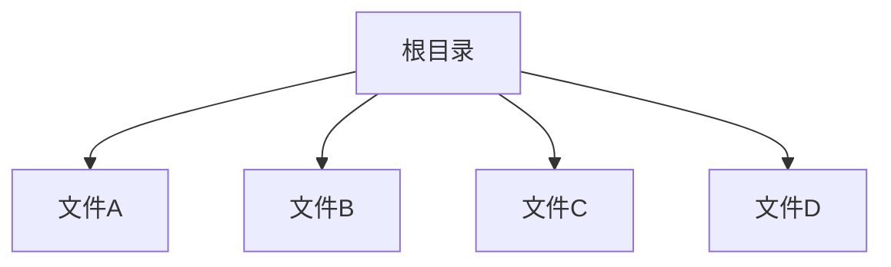
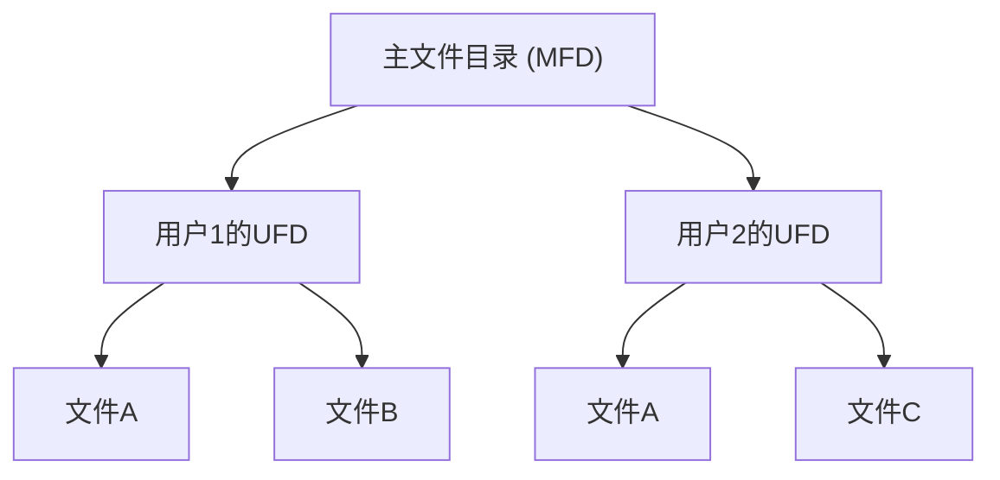
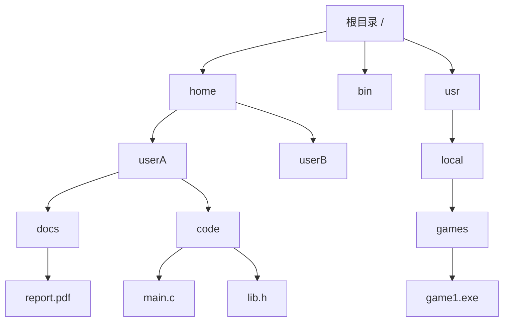
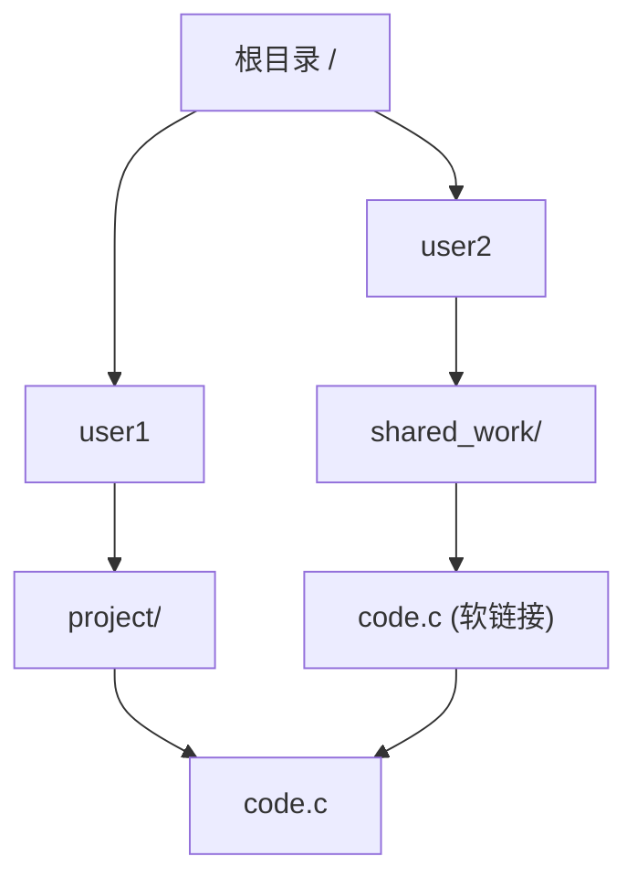
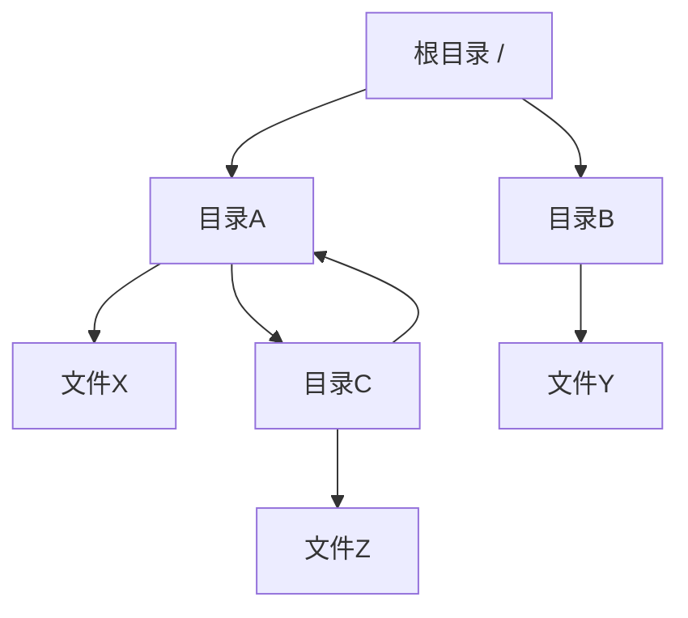

# 第八章 文件系统

## 8.1 文件系统概述

**文件系统 (File System)** 是操作系统中负责管理和存储文件的组件，它为用户和应用程序提供了一个统一的逻辑视图来访问存储在辅助存储设备上的数据。文件系统抽象了物理存储设备的复杂性，将数据组织成文件和目录的层次结构。

### 8.1.1 文件系统的作用

文件系统主要解决两个核心问题：

1. **用户界面设计**：定义文件和其属性、操作以及目录结构应该如何呈现给用户
2. **物理实现**：创建算法和数据结构将逻辑文件系统映射到物理存储设备上

主内存通常太小，无法永久容纳所有数据和程序，因此计算机系统使用辅助存储作为主内存的备份。辅助存储设备包括磁盘、磁带、光盘、软盘、闪存等，它们在访问时间、容量、数据传输速率和数据传输方法等方面各不相同。

### 8.1.2 文件系统的层次结构

文件系统被组织成多个层次，从上到下包括：

1. **应用程序 (Application Programs)**
2. **逻辑文件系统 (Logical File System)**
3. **文件组织模块 (File-Organization Module)**
4. **基本文件系统 (Basic File System)**
5. **I/O控制 (I/O Control)**
6. **设备 (Devices)**

#### 逻辑文件系统层
- 管理元数据信息（除实际数据外的所有文件系统结构）
- 管理目录结构
- 通过文件控制块(FCB)管理文件结构
- 负责保护和安全

#### 文件组织模块层
- 了解文件及其逻辑块，以及物理块
- 将文件的逻辑块地址转换为物理块地址
- 管理空闲空间：跟踪未分配的块，并在请求时提供这些块

#### 基本文件系统层
- 向适当的设备驱动程序发出通用命令，在磁盘上读写物理块
- 输入：检索块123
- 输出：检索驱动器1，柱面73，磁头2，扇区10

#### I/O控制层
- 由设备驱动程序和中断处理程序组成，用于在主内存和磁盘系统之间传输信息
- 设备驱动程序可以看作是翻译器，将高级命令转换为硬件控制器使用的低级硬件特定指令

## 8.2 文件概念与接口

### 8.2.1 文件的定义

**文件 (File)** 是记录在辅助存储上的相关信息的命名集合。通常，文件表示程序（源代码和目标形式）和数据。程序或数据除非在文件中，否则无法写入辅助存储。

### 8.2.2 文件属性

文件具有以下基本属性：

- **名称 (Name)**：符号文件名，以人类可读的形式
- **标识符 (Identifier)**：在文件系统内标识文件的唯一标签（通常是数字）
- **类型 (Type)**：支持不同类型的系统需要此信息
- **位置 (Location)**：指向设备上文件位置的指针
- **大小 (Size)**：当前文件大小
- **保护 (Protection)**：控制谁可以进行读、写、执行操作
- **时间、日期和用户标识**：用于保护、安全和使用监控的数据

有关文件的信息保存在目录结构中，该结构维护在磁盘上。

### 8.2.3 文件类型

#### 按内容分类
- **数据文件**：数字、字母、字母数字、二进制
- **程序文件**：源程序、目标形式、可执行程序

#### 按形式分类
- **自由形式**：如文本文件，含义由文件的创建者和用户定义
- **格式化严格**：如数据库文件

### 8.2.4 文件操作

#### 六个基本操作
1. **创建 (Create)**：分配文件空间并分配目录条目
2. **读取 (Read)**：从文件中读取数据
3. **写入 (Write)**：向文件中写入数据
4. **重定位/查找 (Seek)**：在文件内搜索特定位置
5. **删除 (Delete)**：查找目录条目并释放所有文件空间，擦除目录条目
6. **截断 (Truncate)**：擦除文件内容但保留其属性（长度除外，设为0，释放文件空间）

#### 其他常见操作
- **追加 (Appending)**：在文件末尾添加数据
- **重命名 (Renaming)**：更改文件名
- **获取/设置文件属性**：读取或修改文件的元数据

### 8.2.5 打开文件操作

#### Open操作
```c
int fd = open(filename, mode);
```

- 在磁盘上搜索目录结构以查找条目F
- 将目录条目复制到打开文件表中
- 分配文件描述符
- 返回文件描述符给调用者

大多数文件操作都涉及搜索与命名文件关联的目录条目。为避免常量搜索，系统调用`open()`在其他操作之前使用。

#### Close操作
```c
close(fd);
```

- 将打开文件表中的目录条目复制到磁盘上的目录结构
- 释放文件描述符
- 从打开文件表中删除条目

#### 打开文件表 (Open-File Table)

为了高效管理打开的文件，操作系统在内存中维护两种类型的打开文件表：

1.  **系统级打开文件表 (System-wide Open-File Table)**
    - **作用**：该表是系统范围内所有打开文件的一个中央仓库，每个文件在被至少一个进程打开时，都会在该表中拥有一个唯一的条目。
    - **内容**：每个条目包含文件的关键信息，这些信息对于所有打开该文件的进程都是共享的：
        - **文件控制块 (FCB) 的副本**：当文件首次被 `open()` 系统调用打开时，其磁盘上的 FCB/i-node 信息会被复制到内存中的此表项中。
        - **文件磁盘位置**：文件的物理位置信息，缓存在内存中以避免每次操作都进行磁盘读取。
        - **文件打开计数 (Open Count)**：一个引用计数器，记录当前有多少个进程正在使用（打开）该文件。当这个计数变为0时，表示没有进程再使用该文件，系统会将其从系统级打开文件表中移除，并可能将修改后的 FCB 写回磁盘。
        - **访问权限**：该文件在整个系统中的基本访问权限。

2.  **进程级打开文件表 (Per-process Open-File Table)**
    - **作用**：每个进程都拥有一个独立的打开文件表。这个表管理的是该进程当前打开的所有文件。
    - **内容**：每个条目包含进程私有的文件信息：
        - **文件描述符 (File Descriptor, FD)**：一个小的整数索引，由 `open()` 系统调用返回，并被进程用来引用其打开的文件。它是进程访问文件的句柄。
        - **文件指针 (File Pointer)**：指向该进程在文件中当前读/写位置的指针。这个指针对于每个进程是唯一的，即使多个进程打开同一个文件，它们也可以有不同的读写位置。
        - **访问模式 (Access Mode)**：该进程打开文件时指定的模式（例如：只读、只写、读写、追加等）。
        - **指向系统级表的指针**：每个进程级表项都包含一个指向系统级打开文件表中对应条目的指针。这样，多个进程可以共享同一个系统级表项（即同一个文件），但各自维护独立的访问状态。

#### Open 操作的详细流程 (`open(filename, mode)`)

当应用程序调用 `open(filename, mode)` 时，文件系统会执行以下步骤：

1.  **搜索目录结构**：在磁盘的目录结构中搜索指定的 `filename`，以找到对应的文件控制块 (FCB)。
2.  **检查权限**：根据请求的 `mode` 和 FCB 中的权限信息，检查当前用户是否有权打开该文件。
3.  **更新系统级打开文件表**：
    - 如果该文件是第一次被任何进程打开，系统会在**系统级打开文件表**中创建一个新条目，并将 FCB 的相关信息复制到该条目中，同时设置文件打开计数为 1。
    - 如果文件已被其他进程打开，系统会找到其在系统级表中的现有条目，并将该条目的文件打开计数加 1。
4.  **更新进程级打开文件表**：系统在当前进程的**进程级打开文件表**中创建一个新条目。
    - 为该条目分配一个最小可用且唯一的**文件描述符**。
    - 设置文件指针到文件的起始位置（或根据 `mode` 设置）。
    - 记录该进程的访问模式。
    - 设置一个指针，指向系统级打开文件表中对应文件的条目。
5.  **返回文件描述符**：将新分配的文件描述符返回给调用进程。此后，进程将使用这个文件描述符来进行 `read()`, `write()`, `close()` 等操作。

#### Close 操作的详细流程 (`close(fd)`)

当应用程序调用 `close(fd)` 时，文件系统会执行以下步骤：

1.  **释放进程级资源**：从当前进程的**进程级打开文件表**中删除与 `fd` 对应的条目，并释放该文件描述符。
2.  **更新系统级打开文件表**：找到该进程级条目所指向的**系统级打开文件表**中的条目。
    - 将该系统级条目的文件打开计数减 1。
    - 如果文件打开计数变为 0（表示没有其他进程正在使用该文件），则将该文件的 FCB 信息（如果发生修改）写回磁盘的目录结构中，并从系统级打开文件表中删除该条目。

### 8.2.6 文件锁定

**文件锁定 (File Locking)** 由某些操作系统和文件系统提供，用于调解对文件的访问。

#### 锁定类型
- **共享锁 (Shared Lock)**：读者锁，多个进程可以同时持有
- **排他锁 (Exclusive Lock)**：写者锁，只有一个进程可以持有

#### 锁定方式
- **强制性锁定 (Mandatory)**：一旦进程获得排他锁，其他任何访问都被拒绝
- **建议性锁定 (Advisory)**：进程可以查找锁的状态并决定要做什么

### 8.2.7 文件访问方法

#### 顺序访问 (Sequential Access)
- **描述**：这是最简单也是最常见的文件访问方法，数据按照其在文件中的物理顺序进行读写。就像阅读一本书，您从头开始，一页一页地按顺序读到结尾。
- **特点**：
    - **按顺序处理记录**：每次操作都会自动移动文件指针到下一个逻辑位置。
    - **基于磁带模型**：最初用于磁带存储，磁带本身就是顺序访问设备。即使在磁盘上，对于日志文件或简单的文本处理，顺序访问依然高效。
- **操作**：
    - `read next`：读取当前位置的下一条记录，并自动将文件指针移动到下一条记录的开头。
    - `write next`：在当前位置写入下一条记录，并自动将文件指针移动到新写入记录的末尾。
    - `reset`：将文件指针重新定位到文件的开头，允许重新开始读取或写入。
- **应用场景**：日志文件、文本处理、编译器的中间文件、音频或视频流。

#### 直接访问 (Direct Access)
- **描述**：也称为随机访问，允许程序直接跳到文件中的任何位置进行读写，而无需按顺序遍历之前的数据。这类似于在CD上选择并播放特定的音轨。
- **特点**：
    - **随机读写**：可以快速访问文件中任意指定位置的数据。
    - **基于磁盘模型**：磁盘作为随机访问设备，非常适合这种访问模式。
    - **需要相对块号**：应用程序需要知道或计算出数据在文件中的相对位置（例如，相对块号或字节偏移量）。
- **操作**：
    - `read n`：读取文件中第 `n` 个（或以 `n` 为偏移量）逻辑块的数据。
    - `write n`：向文件中第 `n` 个（或以 `n` 为偏移量）逻辑块写入数据。
    - `position to n`：将文件指针直接移动到文件中第 `n` 个（或以 `n` 为偏移量）逻辑块的开头，后续的读写操作将从该位置开始。
- **应用场景**：数据库系统（需要快速查找特定记录）、文件索引、随机存取大文件中的特定数据块。

#### 其他访问方法
除了顺序访问和直接访问，为了满足更复杂和高效的数据检索需求，文件系统还支持基于索引的访问方法。
- **描述**：通常涉及为文件构建一个或多个索引结构。这些索引不直接存储数据，而是存储指向文件中实际数据位置的指针。
- **工作原理**：
    - **搜索索引**：要从文件中查找特定记录时，首先在索引中搜索该记录的键或标识符。
    - **使用指针直接访问**：索引条目中包含一个指针，指向数据在文件中的物理位置。系统利用这个指针直接跳到文件中对应的数据块，从而快速检索所需记录。
- **针对大文件**：对于非常大的文件，索引本身可能会变得非常大，以至于无法完全保存在主内存中。在这种情况下，索引文件可能也会被组织成多级结构（例如，B-树或B+树），或者部分索引会被缓存，以优化性能。
- **应用场景**：数据库管理系统、大型文件管理系统，其中数据的查找效率是关键。这种方法结合了顺序访问和直接访问的优点，通过牺牲一部分存储空间来换取更高的访问速度。

## 8.3 目录系统

### 8.3.1 目录概述

**目录 (Directory)** 用于组织文件（和目录），可以看作是将文件名转换为其目录条目的符号表。

#### 目录操作
- **搜索文件**：在目录中查找特定文件
- **创建文件**：在目录中添加新的文件条目
- **删除文件**：从目录中删除文件条目
- **列出目录**：显示目录中的所有文件
- **重命名文件**：更改目录中文件的名称
- **遍历文件系统**：系统地访问每个目录和文件

#### 目录组织的评价标准
- **效率**：快速定位文件
- **命名**：方便用户使用
  - 两个用户可以对不同文件使用相同名称
  - 同一文件可以有几个不同的名称
- **分组**：按属性对文件进行逻辑分组（例如，所有Java程序、所有游戏）

### 8.3.2 目录结构类型

#### 单级目录 (Single-Level Directory)
- **描述**：这是最简单的目录结构，所有文件都存放在一个公共的目录中。系统维护一个包含所有文件的名称和属性的列表。
- **优点**：实现简单，查找文件速度快（因为只有一个地方需要查找）。
- **缺点**：
    - **命名问题**：所有文件必须具有唯一的名称。随着文件数量的增加，很难为新文件找到唯一的名称，并且容易导致命名冲突。
    - **分组问题**：无法对文件进行逻辑分组，用户难以管理大量文件，也无法区分不同用户的文件。
- **示意图**：


#### 二级目录 (Two-Level Directory)
- **描述**：为了解决单级目录的命名冲突和分组问题，二级目录为每个用户提供了一个单独的用户文件目录（UFD）。系统维护一个主文件目录（MFD），其中包含每个用户的UFD入口。当用户登录时，他们的UFD会被激活。
- **优点**：
    - **解决命名冲突**：不同用户可以在自己的UFD中使用相同的文件名，互不影响。
    - **文件隔离**：每个用户的私有文件得到更好的隔离和管理。
    - **搜索效率高**：搜索只需在用户的UFD中进行。
- **缺点**：
    - **共享困难**：用户之间共享文件变得困难，因为文件路径依赖于特定的用户UFD。
    - **缺乏分组能力**：每个UFD内部仍然是单级结构，无法对用户自己的文件进行进一步的逻辑分组。
- **示意图**：

- **路径名**：用户名和文件名共同定义从根（MFD）到叶子（文件）的路径，例如 `/User1/FileA`。

#### 树状目录 (Tree-Structured Directories)
- **描述**：最常见的目录结构，允许用户创建自己的子目录，从而形成一个层次化的树状结构。目录本身被视为一种特殊类型的文件。
- **优点**：
    - **灵活的分组能力**：用户可以根据需要创建任意深度的目录结构，对文件进行高度灵活的组织和管理。
    - **支持多级文件路径**：通过目录名连接形成路径，方便文件定位。
    - **易于管理**：逻辑清晰，便于用户查找和管理文件。
- **示意图**：

- **当前目录 (工作目录)**：系统会维护一个“当前工作目录”，用户可以在此目录中直接创建或删除文件/子目录，无需指定完整路径。
- **路径名类型**：
    - **绝对路径名**：从根目录开始的完整路径，例如 `/home/userA/docs/report.pdf`。
    - **相对路径名**：从当前工作目录开始的路径，例如如果当前目录是 `/home/userA`，则 `docs/report.pdf` 是一个相对路径。

#### 无环图目录 (Acyclic-Graph Directories)
- **描述**：在树状目录的基础上，允许文件或子目录在文件系统中拥有多个父目录，形成一个没有环的图结构。这通过“链接”机制实现，即一个文件或目录可以被多个不同的路径引用。
- **实现共享的方法**：
    1. **创建链接 (Link)**：链接是指向另一个文件或目录的指针。
        - **硬链接 (Hard Link)**：指向同一个i-node（文件内容和元数据）的多个目录条目。所有硬链接都指向同一个实际文件，删除其中一个链接不会删除文件本身，直到所有链接都被删除。硬链接只能链接到同一文件系统内的文件，不能链接目录。
        - **软链接 (Soft Link / Symbolic Link)**：一个特殊的文件，其内容是另一个文件或目录的路径名。软链接可以跨文件系统，也可以链接目录。删除软链接不会影响原始文件。
    2. **复制所有共享信息**：直接复制文件内容，但这会导致数据冗余和一致性问题（修改一份不会同步到另一份）。
- **示意图 (软链接示例)**：

- **潜在问题**：
    - **遍历文件系统**：遍历算法需要避免多次访问共享结构，并处理循环引用（虽然是“无环”，但在概念上可能因误操作形成）。
    - **文件删除**：当一个文件有多个链接时，删除操作需要更复杂的设计，以避免产生悬空指针（如果链接的目标被删除而链接本身未被清理）。通常使用引用计数来管理硬链接。

#### 通用图目录 (General Graph Directory)
- **描述**：允许在目录结构中存在循环（环），即一个目录可以包含指向其祖先目录的链接，或者形成其他复杂的循环引用。
- **优点**：提供了最大的灵活性，可以表示任意复杂的共享和引用关系。
- **缺点**：
    - **遍历问题**：遍历文件系统变得极其复杂，需要复杂的算法来检测和避免无限循环。
    - **删除问题**：删除文件时，引用计数可能无法完全解决循环引用问题，可能需要垃圾回收机制来识别和回收不再被引用的文件或目录。悬空指针问题也更加突出。
- **示意图 (循环引用示例)**：

- **实现**：通常不直接实现，因为管理复杂性和潜在问题使得其在实际文件系统中应用较少。无环图目录通过限制链接类型或强制检查来避免循环。

### 8.3.3 目录实现

#### 线性列表 (Linear List)
使用带有指向数据块指针的文件名线性列表：

**操作过程**：
- **查找文件**：需要线性搜索
- **创建文件**：搜索目录确保没有同名文件存在，然后在目录末尾添加新条目
- **删除文件**：搜索目录找到文件，删除条目，释放分配给文件的空间

**优缺点**：
- 编程简单，但执行耗时
- 搜索代价昂贵

#### 哈希表 (Hash Table)
使用线性列表存储目录条目，使用哈希表根据文件名快速找到目录条目：

**有冲突版本**：
- 每个哈希条目有多个值的列表
- 使用哈希函数将文件名映射到哈希值
- 使用该值索引哈希表，然后搜索列表找到目录条目

**无冲突版本**：
- 每个哈希条目只有单个值
- 哈希函数应该动态改变
- 最快的方法

**优点**：减少目录搜索时间

## 8.4 文件系统实现机制

### 8.4.1 文件系统的数据结构

#### 磁盘上的结构
1. **启动控制块 (Boot Control Block)**
   - UFS：启动块，NTFS：分区启动扇区
   - 用于从该分区启动操作系统

2. **分区控制块 (Partition Control Block)**
   - UFS：超级块，NTFS：主文件表(MFT)
   - 包含块号、块大小、空闲块计数、空闲块指针、空闲FCB计数和FCB指针

3. **目录结构**
   - 用于组织文件
   - UFS：包括文件名和i-node号

4. **文件控制块 (FCB) / i-node (索引节点)**
   - UFS (Unix File System) 中称为 i-node，NTFS 中则集成在 MFT (主文件表) 条目中。
   - 包含文件的所有元数据信息（除文件名本身），如：
     - 文件权限 (Protection bits)
     - 所有者 (Owner ID) 和组 (Group ID)
     - 文件大小 (File size in bytes)
     - 数据块在磁盘上的位置（指向文件实际数据块的指针列表或索引结构）
     - 创建时间、最后修改时间、最后访问时间
     - 文件类型（普通文件、目录、符号链接等）
     - 链接计数（硬链接数量）
   - 当文件被打开时，FCB/i-node 的副本会被加载到内存中的文件控制块结构中。

#### 内存中的结构
用于文件系统管理和通过缓存提高性能：

1. **内存中的分区表**：包含每个挂载分区的信息
2. **内存中的目录结构**：包含最近访问目录的目录信息
3. **系统级打开文件表**：包含每个打开文件的FCB副本以及其他信息
4. **进程级打开文件表**：包含指向系统级打开文件表中适当条目的指针以及其他信息

### 8.4.2 文件分配方法

#### 连续分配 (Contiguous Allocation)
每个文件占用磁盘上一组连续的块：

**特点**：
- 目录只需要起始位置（块号）和长度（块数）
- 支持顺序访问和直接访问
- 实现简单

**问题**：
- **外部碎片**：浪费空间（动态存储分配问题）
- **文件无法增长**：如何为文件指定初始大小

**改进方案 - 基于扩展区的文件系统**：
- 初始分配一块连续空间
- 如果空间不够，添加一个扩展区
- 扩展区是连续的磁盘块
- 文件由一个或多个扩展区组成

#### 链式分配 (Linked Allocation)
每个文件都是磁盘块的链表，块可以分散在磁盘的任何地方：

**特点**：
- 目录包含指向文件第一个和最后一个块的指针
- 每个磁盘块包含指向下一个块的指针

**优点**：
- 简单，只需要起始地址
- 没有外部碎片
- 容易分配和回收块

**缺点**：
- 没有随机访问
- 指针浪费空间
- 可靠性差

**文件分配表 (FAT)**：
- MS-DOS和OS/2使用的磁盘空间分配
- FAT是重复的
- 支持直接访问
- 被缓存
- 磁盘利用率差

#### 索引分配 (Indexed Allocation)
将所有指针聚集到一个位置：索引块：

**特点**：
- 每个文件都有自己的索引块
- 目录包含索引块的地址
- 索引表包含指向文件各个块的指针

**访问方法**：
- 支持顺序访问和直接访问
- 需要索引块
- LA/1024 = Q（索引表中的位移）+ R（块中的位移）

**大文件的解决方案**：当文件非常大时，单个索引块可能不足以存储所有数据块的指针。为了解决这个问题，有几种策略可以扩展索引分配方案以支持大文件。
1.  **链式方案 (Linked Scheme)**
    - **描述**：在这种方案中，如果一个索引块无法容纳所有数据块的指针，它会包含一个指向“下一个”索引块的指针，形成一个索引块的链表。每个索引块除了存储数据块的指针外，还会有一个额外的字段指向下一个索引块。
    - **优点**：能够支持任意大小的文件，理论上没有文件大小限制，因为可以不断添加索引块。
    - **缺点**：
        - **随机访问效率低**：为了访问文件深处的数据块，可能需要遍历多个索引块，导致多次磁盘I/O操作，降低了随机访问的效率。
        - **空间浪费**：每个索引块都需要额外的空间来存储指向下一个索引块的指针。
2.  **多级索引 (Multi-level Indexing)**
    - **描述**：类似于虚拟内存中的分页机制，多级索引通过构建一个索引的层次结构来管理大文件。顶层索引块包含指向次级索引块的指针，次级索引块再指向更低级的索引块或最终的数据块。
    - **优点**：
        - **支持极大文件**：通过增加索引级别，可以支持非常大的文件，其理论最大文件大小呈指数级增长。
        - **分级加载**：只有访问数据块路径上的索引块才需要被加载到内存，减少了内存占用。
    - **缺点**：
        - **访问开销**：访问一个数据块可能需要读取多个索引块（从顶层到数据块），增加了磁盘I/O次数和访问延迟。
        - **复杂性**：实现和管理比单级索引更复杂。
    - **示例**：如果一个顶层索引块指向1000个次级索引块，每个次级索引块又指向1000个数据块，那么理论上可以管理 \(1000 \times 1000 = 10^6\) 个数据块。
3.  **组合方案 (Combined Scheme)**
    - **描述**：这是UNIX文件系统（如UFS、Ext系列）普遍采用的一种混合方法，旨在结合直接寻址和间接寻址的优点，以高效地支持从小文件到超大文件的各种尺寸。它在一个文件的i-node（索引节点）中存储多种类型的指针。
    - **UNIX UFS的实现**：
        - **直接指针 (Direct Pointers)**：i-node中包含固定数量（通常是12个）的直接指向数据块的指针。对于小文件，所有数据块都可以通过这些直接指针访问，从而实现快速访问，无需额外的磁盘I/O来读取索引块。
            - 例如：12个直接指针，每个指针指向一个4KB的块，总共可以覆盖 \(12 \times 4KB = 48KB\) 的文件内容。
        - **单级间接块 (Single Indirect Block)**：如果文件大小超过直接指针能覆盖的范围，i-node中的一个指针会指向一个“单级间接块”。这个间接块中存储的都是数据块的指针。这样可以大大扩展文件大小。
            - 例如：一个4KB的间接块如果存储4字节的指针，可以存储 \(4KB / 4B = 1024\) 个指针。每个指针指向一个4KB的数据块，因此单级间接块可以覆盖 \(1024 \times 4KB = 4MB\) 的文件内容。
        - **双级间接块 (Double Indirect Block)**：如果文件进一步增大，i-node中的另一个指针会指向一个“双级间接块”。这个块不直接指向数据块，而是指向多个“单级间接块”。每个单级间接块再指向数据块。
            - 例如：一个4KB的双级间接块可以指向1024个单级间接块。每个单级间接块又覆盖4MB，因此双级间接块可以覆盖 \(1024 \times 4MB = 4GB\) 的文件内容。
        - **三级间接块 (Triple Indirect Block)**：对于超大文件，i-node中的最后一个指针可能指向一个“三级间接块”。这个块指向多个双级间接块，形成一个三层索引结构。
            - 例如：一个4KB的三级间接块可以指向1024个双级间接块。每个双级间接块又覆盖4GB，因此三级间接块可以覆盖 \(1024 \times 4GB = 4TB\) 的文件内容。
    - **优点**：
        - **高效支持小文件**：小文件只需直接指针即可访问，速度快。
        - **有效支持大文件**：通过间接指针，可以无缝扩展到非常大的文件，且相对于纯多级索引，访问深度随文件大小增长相对缓慢。
        - **空间利用率高**：根据文件大小按需分配索引块，避免了不必要的索引开销。
    - **缺点**：
        - **访问深度增加**：对于非常大的文件，访问数据可能需要多次磁盘I/O来遍历多级间接块。

### 8.4.3 空闲空间管理

#### 位向量 (Bit Vector)

- **描述**：位向量（也常称为位图或位视图）是空闲空间管理的一种简单且常用的方法。它通过使用一个连续的二进制位序列来表示磁盘上所有块的分配状态。在位向量中，磁盘上的每个块都对应一个位。通常，如果一个位的值为1，表示对应的磁盘块是空闲的；如果为0，则表示该块已被分配（有时也可能相反）。

- **工作原理**：
    - **映射关系**：位向量中的第 `i` 个位对应磁盘上的第 `i` 个块。通过检查特定位的值，文件系统可以迅速判断对应块的可用性。
    - **分配块**：当需要分配一个空闲块时，文件系统会扫描位向量，查找第一个值为1的位。一旦找到，就将该位设为0，并将对应的块号返回给调用者。
    - **回收块**：当一个块被释放时，文件系统会找到该块对应的位，并将其设为1。
    - **块号计算**：给定一个位的索引或位置，可以通过简单的数学运算（例如，如果每个字是32位，则块号 = `(字数 * 32) + 位在字中的偏移`）来计算出对应的磁盘块号。

- **优缺点**：
    - **优点**：
        - **实现简单**：逻辑直观，易于理解和实现。
        - **高效查找连续空闲块**：对于需要连续块（如连续分配的文件）的请求，可以通过扫描位向量快速找到一系列连续的1，从而找到一个足够大的空闲空间。
        - **高效管理小块**：对于每个块大小固定的文件系统，位向量可以非常有效地管理每个块的分配。
        - **易于在内存中缓存**：如果磁盘块数量不是极其庞大，整个位向量可以加载到主内存中进行操作，从而大大提高查找和更新的效率。
    - **缺点**：
        - **额外空间开销**：位向量本身需要占用一定的存储空间。虽然每个块只占用一位，但对于非常大的磁盘（如TB级别），位向量也可能变得相当大，无法完全常驻内存。例如，一个1TB的磁盘，如果块大小为4KB，则有 \(1TB / 4KB = 2^{40} / 2^{12} = 2^{28}\) 个块，需要 \(2^{28}\) 位，即 \(2^{28} / 8 = 2^{25}\) 字节 = 32MB的位向量空间。
        - **扫描效率**：当位向量无法完全加载到内存时，每次扫描或更新都需要进行磁盘I/O，这会降低效率。即使在内存中，对于极大的位向量，查找第一个空闲位也可能需要较长时间。
        - **碎片管理**：虽然可以找到连续空闲块，但无法直接减少外部碎片（磁盘上分散的小空闲块）。

- **应用场景**：位向量非常适合用于管理磁盘块数量相对固定或可以完全在内存中表示的磁盘分区。它在许多现代文件系统中作为空闲空间管理的一部分被采用，尤其是在对查找连续块有需求的场景中。

#### 链表 (Linked List)

- **描述**：链式空闲空间管理方法将所有空闲磁盘块链接在一起，形成一个空闲块链表。每个空闲块的起始部分包含一个指向下一个空闲块的指针。

- **工作原理**：
    - **链表结构**：文件系统维护一个指向链表第一个空闲块的指针。每个空闲块内部，除了存储数据，还会预留一小部分空间来存储指向下一个空闲块的块号或地址。
    - **分配块**：当需要分配一个空闲块时，系统只需从链表头部取走第一个空闲块，并更新链表头指针指向下一个块。
    - **回收块**：当一个块被释放时，它会被添加到链表的头部或尾部，成为新的空闲块。

- **优缺点**：
    - **优点**：
        - **没有外部碎片**：由于空闲块可以分散在磁盘的任何位置，并且每次只分配一个块，因此不会产生外部碎片。
        - **空间效率高**：除了每个块内部存储的指针外，几乎没有额外的存储开销来管理空闲空间，因为它不需要像位图那样单独的位向量结构。
        - **易于实现**：基本逻辑相对简单。
    - **缺点**：
        - **没有随机访问能力**：为了找到特定的空闲块或连续的多个空闲块，文件系统可能需要遍历整个链表，这在链表很长时效率非常低。这种方法主要适合顺序分配。
        - **可靠性差**：如果链表中的某个指针损坏或丢失，其后的所有空闲块都可能变得无法访问，导致空闲空间丢失。
        - **I/O效率低**：由于空闲块可能不连续，频繁的分配和回收操作可能导致大量的随机磁盘I/O，降低性能。

- **应用场景**：这种方法在早期的文件系统或对空间利用率要求极高且不频繁进行随机访问的系统中可能使用，但由于其随机访问效率和可靠性问题，现代文件系统很少单独采用此方法。

#### 分组 (Grouping)

- **描述**：分组方法是链表方法的改进，旨在提高查找连续空闲块的效率。它通过将多个空闲块的地址存储在一个空闲块中，而不是每个空闲块只存储一个指向下一个块的指针。

- **工作原理**：
    - **分组存储**：文件系统维护一个指向第一个空闲块的指针。这个"第一个空闲块"不直接作为数据块使用，而是存储了接下来 N 个空闲块的地址。
    - **逐组分配**：当需要分配空闲块时，系统会从当前"分组块"中取走所需数量的空闲块地址。当当前分组块中的地址用完后，系统会使用其存储的最后一个地址，跳转到下一个"分组块"，重复上述过程。
    - **回收块**：回收的块可以添加到当前活跃的分组块中（如果还有空间），或者如果当前分组块已满，则成为新的分组块，其自身存储一批新的空闲块地址。

- **优缺点**：
    - **优点**：
        - **提高了查找效率**：每次读取一个分组块，就可以获得多个空闲块的地址，减少了磁盘I/O次数，特别是在需要分配多个连续或非连续块时。
        - **适用于UNIX文件系统**：这种方法是UNIX文件系统管理空闲空间的一种常见优化，因为它能更好地支持需要连续块的分配（如大文件的初始分配）。
        - **没有外部碎片**：与链表法类似，空闲块仍然可以分散，不会产生外部碎片。
    - **缺点**：
        - **复杂性增加**：相比简单的链表法，其实现逻辑更复杂。
        - **部分空间浪费**：每个分组块需要预留一部分空间来存储其他空闲块的地址，虽然比位图法小，但仍然是额外的开销。
        - **可靠性问题**：如果一个分组块损坏，其中存储的所有空闲块地址都可能丢失。

- **应用场景**：分组方法适用于需要更高效地管理空闲空间，尤其是需要批量分配空闲块的场景，如UNIX文件系统。

#### 计数 (Counting)

- **描述**：计数方法利用了磁盘上空闲块通常会以连续块组的形式出现的事实。它不是存储每个单独空闲块的地址，而是存储一对信息：空闲块的起始地址，以及从该地址开始的连续空闲块的数量。

- **工作原理**：
    - **（起始地址，连续块数）对**：文件系统维护一个空闲空间列表，列表中的每个条目都是一个二元组 `(start_block_address, count)`，表示从 `start_block_address` 开始有 `count` 个连续的空闲块。
    - **分配块**：当需要分配 K 个空闲块时，系统会扫描列表，查找是否有条目能满足需求。如果找到 `(start, count)` 且 `count >= K`，则从该连续块组中分配 K 个块，并更新该条目为 `(start + K, count - K)`。
    - **回收块**：当回收一个或一组连续的块时，系统会尝试将其与列表中现有的连续空闲块组合并，以形成更大的连续块组。例如，如果回收的块紧邻一个已有的空闲块组的末尾或开头，它们可以合并为一个更大的组。

- **优缺点**：
    - **优点**：
        - **列表更小**：对于大量连续的空闲块，一个条目就可以表示很多块，大大减小了空闲列表的大小，降低了内存占用和查找时间。
        - **高效支持连续分配**：非常适合查找和分配连续的空闲块，这对于需要大块连续空间的应用程序（如视频编辑、大型数据库）非常有利。
        - **容易管理批量分配和释放**：批量分配和释放操作可以高效完成，只需修改或添加/删除少量条目。
    - **缺点**：
        - **碎片管理复杂**：虽然能表示连续块，但管理和合并分散的空闲块以减少碎片，以及处理非连续回收的块，可能会增加算法的复杂性。
        - **不适合频繁的小块分配**：如果文件系统主要进行小而分散的块分配和回收，这种方法的效率优势不明显，甚至可能因为合并操作而变得复杂。

- **应用场景**：计数方法特别适合在分配和释放操作中倾向于连续块的文件系统，尤其是在辅助存储设备上连续空闲区域普遍存在的环境中。它通常与其他空闲空间管理方法结合使用，以达到更好的性能和空间利用率。

## 8.5 文件系统挂载与共享

### 8.5.1 文件系统挂载

**挂载 (Mount)** 是指在访问文件系统之前必须先将其挂载，就像使用文件之前必须先打开一样。

#### 挂载过程
1. 读取超级块（通过设备驱动程序）
2. 验证其一致性
3. 必要时修复（fsck）
4. 在内存挂载表结构中添加条目

#### 不同系统的挂载方式

**Windows系统**：
- 启动时挂载：C:, D:

**UNIX系统**：
- 在目录挂载分区
- 在挂载表中添加条目
- 让挂载表条目的一个字段指向该设备上文件系统的超级块
- 在该目录的i-node的内存副本中设置一个字段，指示在该处挂载了哪个设备

### 8.5.2 虚拟文件系统

**虚拟文件系统 (VFS)** 提供面向对象的文件系统实现方式。

#### VFS的作用
- 如何支持多个文件系统？
- 如何将许多文件系统集成到目录结构中？
- 如何在各种文件系统之间无缝移动？

#### VFS的实现
- API是对VFS接口的，而不是对任何特定类型的文件系统
- VFS允许同一系统调用接口（API）用于不同类型的文件系统
- VFS基于称为vnode的文件表示结构，该结构包含网络范围内唯一文件的数字指示符

#### VFS的层次结构
- **顶层**：文件系统接口（open, read, write, close和文件描述符）
- **中间层**：VFS层，通过定义清洁的VFS接口将文件系统通用操作与其实现分离
- **底层**：各种文件系统实现（Ext3、NFS等）

### 8.5.3 文件共享

#### 多用户共享
为了实现共享和保护，系统必须维护更多文件和目录属性：

1. **所有者 (Owner)**
   - 用户ID标识用户，用户可以更改文件并授予访问权限

2. **组 (Group)**
   - 组ID允许用户加入组，允许组访问权限

#### 远程文件系统
在分布式系统上，文件可以通过网络共享：

**网络文件共享方式**：
- 通过FTP等程序手动共享
- 通过万维网半自动共享
- 使用分布式文件系统(DFS)自动共享

**客户端-服务器模型**：
- 允许计算机从一个或多个远程机器挂载一个或多个文件系统
- 服务器：包含文件的机器
- 客户端：寻求访问文件的机器
- 服务器可以为多个客户端服务，客户端可以使用多个服务器

**认证挑战**：
- 客户端和客户端上的用户识别不安全或复杂
- 可以通过IP地址或其他标识符指定客户端，但这些可能被欺骗

#### 分布式信息系统
需要分布式命名服务(DNS)来管理客户端/服务器系统：
- DNS为整个Internet提供主机名到网络地址的转换
- SUN的NIS集中存储用户名、主机名、打印机信息
- Microsoft的CIPS和Active Directory
- LDAP（轻量级目录访问协议）

#### 故障模式
**本地文件系统故障**：
- 磁盘故障
- 目录结构或元数据损坏
- 磁盘控制器故障
- 电缆故障
- 主机适配器故障

**远程文件系统**：
- 由于网络故障、服务器故障增加新的故障模式
- 从故障中恢复可能涉及每个远程请求状态的状态信息
- 无状态协议（如NFS）在每个请求中包含所有信息，允许轻松恢复但安全性较低

## 8.6 文件系统性能与可靠性

### 8.6.1 效率优化

#### 磁盘分配和目录算法优化

**预分配**：
- 在分区上预分配i-node并将它们分布在分区中(UNIX FS)
- 尝试将文件的数据块保持在文件的i-node块附近以减少寻道时间

**变化的簇大小**：
- 不同的簇大小(BSD UNIX)
- 可以填充的地方使用大簇
- 小文件和文件的最后一个簇使用小簇
- 减少碎片

#### 目录条目中数据类型优化

**最后访问日期**：
- 每当读取文件时，必须写入目录结构中的字段
- 必须将目录条目块读入内存，然后写回磁盘
- 对于频繁访问的文件，这个要求可能是低效的

**指针大小**：
- 指针大小限制文件的长度
  - 16位指针：2^16 (64K)
  - 32位指针：2^32 (4G)
  - 64位指针：2^64
- 长指针占用更多存储空间
- 分配和空闲空间管理方法使用更多磁盘空间

### 8.6.2 性能优化技术

#### 缓存机制

**磁盘控制器缓存**：
- 大多数磁盘控制器包括本地内存以形成板载缓存

**缓冲区缓存**：
- 维护主内存的单独部分作为缓冲区缓存

**页面缓存**：
- 使用页面缓存缓存文件数据
- 使用虚拟内存技术（内存映射文件）将文件数据缓存为页面而不是面向文件系统的块

**统一缓冲区缓存**：
- 用于避免双重缓存，允许虚拟内存系统管理文件系统数据
- 统一缓冲区缓存使用相同的页面缓存来缓存内存映射页面和普通文件系统I/O

#### 读写策略

**同步写入**：
- 写入不被缓冲
- 调用例程必须等待数据到达磁盘驱动器才能处理

**异步写入**：
- 数据存储在缓存中，控制返回到调用例程
- 元数据写入可以是同步的
- 操作系统通常在open()系统调用中包含一个标志，允许进程请求同步执行写入

#### 缓存替换算法

**随机访问**：
- LRU似乎是块或页面替换的合理通用算法

**顺序访问**：
- **Free-behind**：一旦请求下一页，立即从缓冲区中删除页面
- **Read-ahead**：请求页面和几个后续页面被读取和缓存

### 8.6.3 故障恢复

#### 一致性检查
定期运行一致性检查程序：
- 比较目录结构中的数据与磁盘上的数据块，并尝试修复任何不一致
- 可以分配未引用的块
- 如果块引用缺失，可以将其添加到空闲空间列表

#### 备份和恢复
**备份策略**：
- 由于磁盘故障，有时整个文件系统需要从备份中恢复
- 备份到另一个磁盘、磁带或其他存储设备
- 增量备份可以减少备份时间和空间

**恢复程序**：
- 从备份中恢复整个文件系统，然后从日志中恢复

### 8.6.4 日志结构文件系统

**日志结构文件系统 (Log-Structured File System)** 记录对文件系统的每次更新作为日志中的事务。

#### 工作原理
- 所有元数据更改都写入日志
- 每个日志条目包含：
  - 事务号
  - 修改的块列表
  - 修改前后的值
- 日志写入是原子的

#### 优点
- 通过重放日志条目可以快速恢复
- 提供事务语义
- 提高写入性能（将随机写入转换为顺序写入）

## 8.7 文件保护与安全

### 8.7.1 访问控制

文件所有者/创建者应该能够控制：
- **可以做什么**：读取、写入、执行等操作
- **由谁来做**：哪些用户或组可以访问

### 8.7.2 访问类型

- **读取 (Read)**：从文件中读取数据
- **写入 (Write)**：向文件中写入数据
- **执行 (Execute)**：将文件作为程序执行
- **追加 (Append)**：在文件末尾添加数据
- **删除 (Delete)**：删除文件
- **列表 (List)**：列出文件名和属性

其他高级功能（重命名、复制、编辑）可能由系统程序实现。

### 8.7.3 访问控制方法

#### 访问控制列表 (ACL)
最常见的方法：基于用户身份的访问控制：
- 每个文件或目录都有一个ACL
- 指定用户名和每个用户允许的访问类型

#### 其他保护方法
- **密码保护**：为每个文件关联密码
- **加密**：对文件内容进行加密保护

## 8.8 实际文件系统示例

### 8.8.1 Unix文件系统 (UFS)
- 使用i-node存储文件元数据
- 支持硬链接和软链接
- 使用组合分配方案（直接指针+间接指针）

### 8.8.2 Windows文件系统

#### FAT (File Allocation Table)
- 简单的文件分配表
- 适用于小容量存储设备
- FAT32支持更大的文件和分区

#### NTFS (New Technology File System)
- 支持大文件和大分区
- 提供文件压缩和加密
- 支持访问控制列表
- 具有日志功能

### 8.8.3 Linux文件系统

#### ext2/ext3/ext4
- ext2：基本的Linux文件系统
- ext3：添加了日志功能
- ext4：改进性能和容量支持

#### 其他Linux文件系统
- ReiserFS：专为小文件优化
- XFS：高性能文件系统
- Btrfs：现代写时复制文件系统

### 8.8.4 网络文件系统 (NFS)
- 允许通过网络访问远程文件
- 客户端-服务器架构
- 支持透明文件访问
- 提供网络文件共享功能